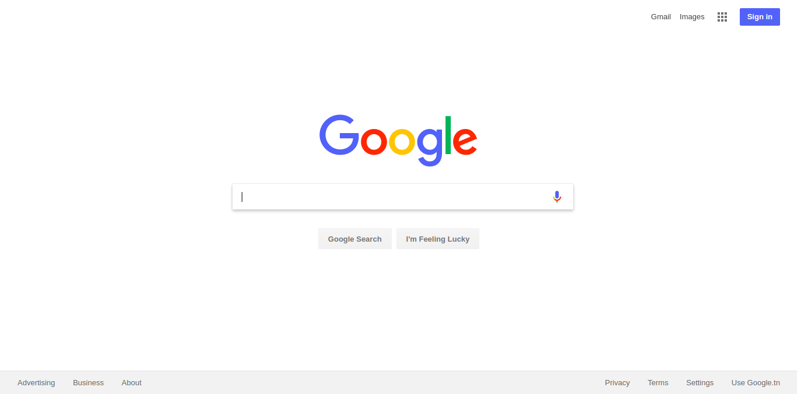
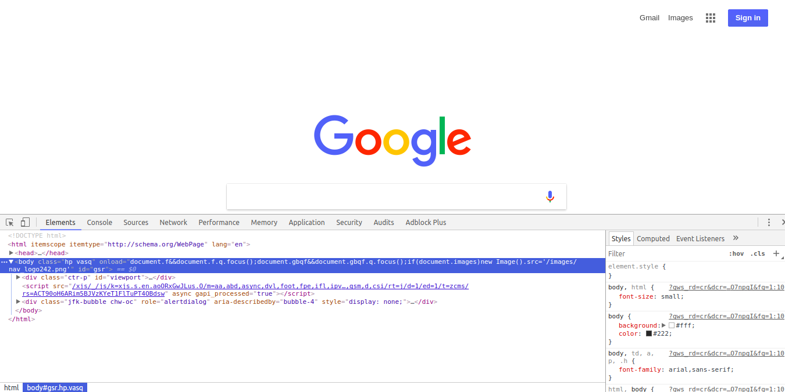

# HTML, the de facto language of the web

At its heart, HTML is a fairly simple language made up of elements, which can be applied to pieces of text to give them different meaning in a document (is it a paragraph? is it a bulleted list? is it part of a table?), structure a document into logical sections (does it have a header? three columns of content? a navigation menu?) and embed content such as images and videos into a page. This module will introduce the first two of these, and introduce fundamental concepts and syntax you need to know to understand HTML.

## Introduction

* Let's start by taking a look at a webpage we're all familiar with, [google.com](www.google.com):

* You have access to the behind-the-scenes code that "creates" the view you see
* You can open the *Chrome Dev Tools* by pressing `F12`
* *Chrome Dev Tools* looks like this:

* As you can see, Chrome Dev Tools has many features we need
* At first it might seem too much, but no worries we will only learn the things we need
* We'll only be focusing on the `Elements` pane for the moment
* This is the part that has the HTML code in it:

---

## What's HTML?

* HTML (stands for HyperText Markup Language), is the standard markup language for creating webpages*
* HTML describes the structure of webpages using markup
* HTML elements are the building blocks of HTML pages
* HTML elements are structures as a tree, i.e. every element has 0 or more child elements but one and only one parent**

\* in fact, HTML is the only markup language of the web

** except the root HTML element, which has no parent element

To get familiar with the structure of HTML, you can play around with the Elements pane :

---

## Inspecting elements

* To inspect the HTML code of any element on the page, right-click it then click on `Inspect`
* You can also use element inspector tool image of element inspector button and hover over elements to inspect them
* Or you can hover over elements inside the Dev Tools Elements pane
