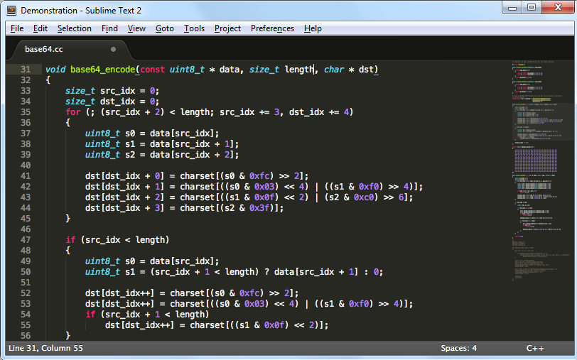
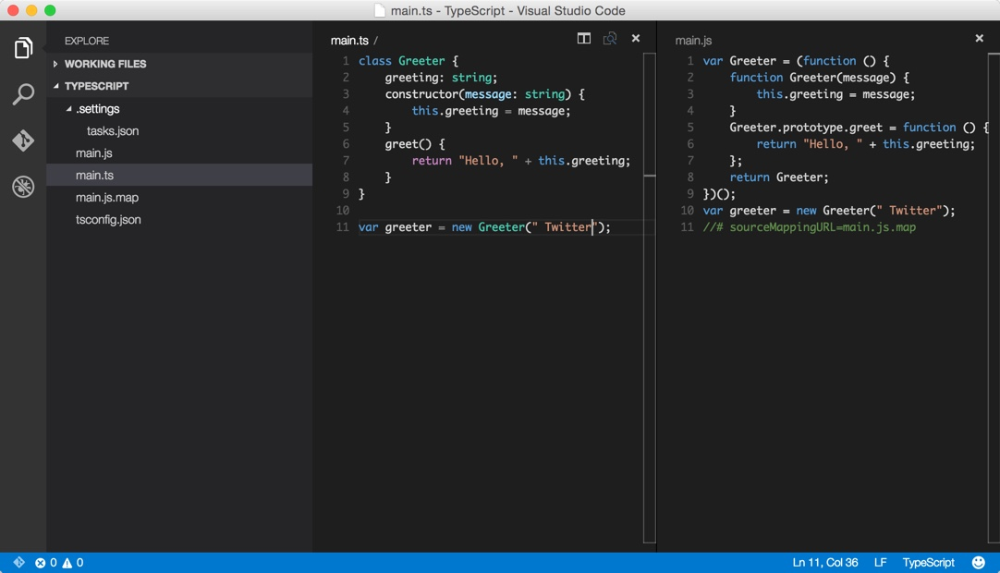

# Choose your editor

* We will write our code in text files
* We can use a normal text editor, e.g. `Notepad/Bloc-notes`, `gedit`...
* Alternatively, we can use a text editor that has special features that can help us coding
* Here are some examples of code editors we can use:
  * Sublime Text 

  * VS Code 

  * Atom 
