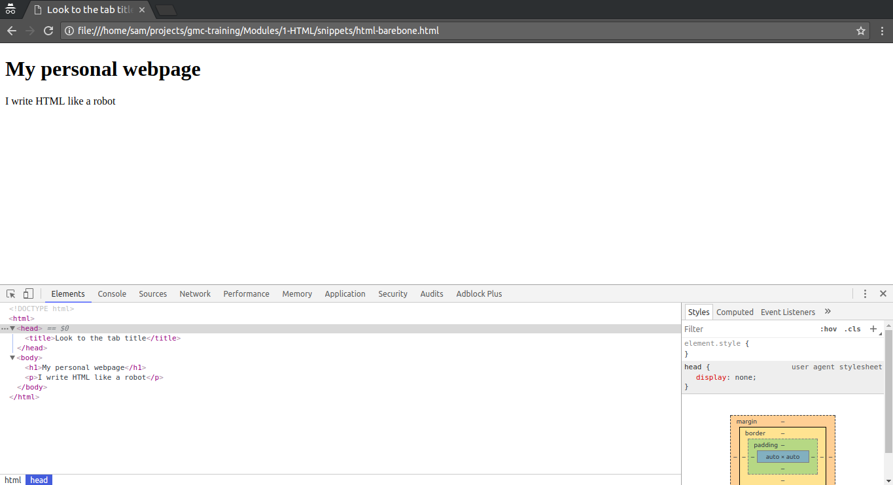

# Getting started with HTML

<strong>Objective: </strong>To gain basic familiarity with the HTML language, and get some practice writing a few HTML elements.

## Anatomy of HTML element

* HTML consists of a series of elements, which you use to enclose, wrap, or mark up different parts of the content to make it appear or act a certain way.

* The enclosing tags can make a bit of content into a hyperlink to link to another page on the web, italicize words, and so on.  For example, take the following line of content:

```code
My cat is very grumpy
```
If we wanted the line to stand by itself, we could specify that it is a paragraph by enclosing it in a paragraph tag  (`<p>`) element:
```html
<p>My cat is very grumpy</p>
```

Let's explore our paragraph element a bit further:

<p align="center">
  
</p>

The main parts of our element are:

1. <strong>The opening tag</strong>: This consists of the name of the element (in this case, p), wrapped in opening and closing angle brackets. This states where the element begins, or starts to take effect — in this case where the start of the paragraph is.
2. <strong>The closing tag</strong>: This is the same as the opening tag, except that it includes a forward slash before the element name. This states where the element ends — in this case where the end of the paragraph is. Failing to include a closing tag is a common beginner error and can lead to strange results.
3. <strong>The content</strong>: This is the content of the element, which in this case is just text.
4. <strong>The element</strong>: The opening tag plus the closing tag plus the content equals the element.

## Nesting elements

You can put elements inside other elements too — this is called nesting. If we wanted to state that our cat is very grumpy, we could wrap the word "very" in a `<strong>` element, which means that the word is to be strongly emphasized:

```html
<p>My cat is <strong>very</strong> grumpy.</p>
```

You do however need to make sure that your elements are properly nested: in the example above we opened the p element first, then the strong element, therefore we have to close the strong element first, then the p. The following is incorrect:

```html
<p>My cat is <strong>very grumpy.</p></strong>
```

The elements have to open and close correctly so they are clearly inside or outside one another. If they overlap like above, then your web browser will try to make a best guess at what you were trying to say, and you may well get unexpected results. So don't do it!

## Writing our first HTML file

* Now we've talked the talk, let's walk the walk. Grab the editor of your choice and let's write us some HTML!
* First, copy the following code into a new HTML file:

```html
<!DOCTYPE html>
<html>
  <head>
    <title>Look to the tab title</title>
  </head>
  <body>
    <h1>My personal webpage</h1>
    <p>I write HTML like a robot</p>
  </body>
</html>
```

* Notice the code is indented to simulate the actual structure of the document.
* We can clearly see the `head` and `body` elements are children of the `html` element and that the `h1` and `p` elements are children of the body.
* It is not mandatory to write with indentation, but it is a good practice
* Now, save the file (remember to save as `.html` file) and open it with Google Chrome. You'll get something like this:



---

## Elements VS Tags

* An HTML element is what the web browser shows on the screen*. In order to create one, you need to describe it to the browser in the HTML file using a tag or a pair of tags**.


\* Actually, not all elements get rendered. For instance, the `header` is just a container for other elements

** Yes, some elements need only one tag. e.g `<hr>` which creates a horizontal line.


1. an HTML description of a `body` element with to child elements: a `h1` and a `p`
2. the opening tag for the `body` element that marks its beginning
3. the closing tag, notice the `/` character that differentiates it from the opening tag. Everything between the opening and closing tags is the content of the element
4. the child elements of the `body`. Notice that the browser would automatically indent them in even if the source code does not for clarity sake

---

## Common HTML tags

Match every tag in the following list with its corresponding definition: `html`, `head`, `title`, `body`, `div`, `p`, `ul`, `ol`, `li`, `h1`..`h6`, `hr`

| Tag | Definition |
|---|---|
|| a *horizontal line* that divides content to sections |
|| a *list item*, it must be the child of a list element |
|| definitely the most used tag, its purpose is usually just to group other elements in groups or *divisions* |
|| a paragraph of text |
|| the *title* of the webpage, browsers use it as the window title as well |
|| an *unordered list*, typically rendered as a bullet list |
|| an *ordered list*, typically rendered as a numbered list |
|| describes the *root* element, the ancestor of all other elements on the page |
|| a non-visible element that holds metadata about the wepage's content as well as links to external resources it uses  |
|| the root element of all *visible* elements on the page, i.e. its *content* |
|| represent different levels of section heading, 1 being the most important |

---

## The comment tag

* Like almost all languages, HTML provides a way for its writers to write comments that get completely ignored by the browser but can be understood by human readers.

* To get familiar with the utility of a comment, we'll be using the previous example and annotating it for clarity:

```html
<!DOCTYPE html>
<html> <!-- Beginning of root element -->
  <head>
    <!-- Most browsers use this title for the window title as well -->
    <title>Look to the tab title</title>
  </head>
  <!--
    The body is the root element for the content of the page
    Notice you can write multi-line comments in the same way
  -->
  <body>
    <h1>My personal webpage</h1>
    <p>I write HTML like a robot</p>
  </body>
</html> <!-- End of root element -->
```
