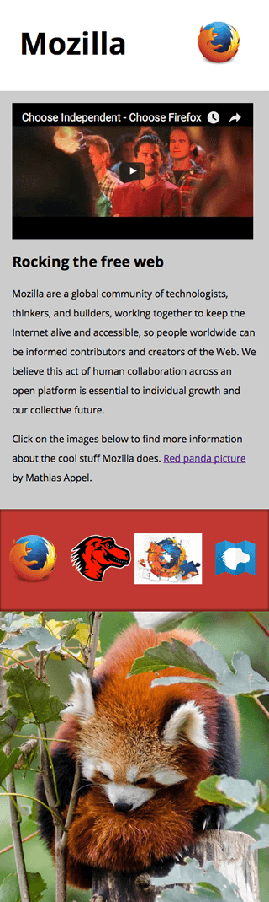

# Mozilla splash page

In this assessment, we'll test your knowledge of some of the techniques discussed in this module's articles, getting you to add some images and video to a funky splash page all about Mozilla!

## Starting point

To start off this assessment, you need to grab the HTML and all the images available in the <a href="resources/">resource</a> directory on github. Save the contents of `index.html` in a file called `index.html` on your local drive, in a new directory. Then save `pattern.png` in the same directory (right click on the image to get an option to save it.)

Access the different images in the `originals` directory and save them in the same way; you'll want to save them in a different directory for now, as you'll need to manipulate (some of) them using a graphics editor before they're ready to be used.

>	<strong>Note:</strong> The example HTML file contains quite a lot of CSS, to style the page. You don't need to touch the CSS, just the HTML inside the <body> element — as long as you insert the correct markup, the styling will make it look correct.

## Project brief

In this assessment we are presenting you with a mostly-finished Mozilla splash page, which aims to say something nice and interesting about what Mozilla stands for, and provide some links to further resources. Unfortunately, no images or video have been added yet — this is your job! You need to add some media to make the page look nice and make more sense. The following subsections detail what you need to do:

<strong>Preparing images</strong>

Using your favourite image editor, create `400px` wide and `120px` wide versions of:

* `firefox_logo-only_RGB.png`
* `firefox-addons.jpg`
* `mozilla-dinosaur-head.png`

Call them something sensible, e.g. `firefoxlogo400.png` and `firefoxlogo120.png`.

Along with `mdn.svg`, these images will be your icons to link to further resources, inside the further-info area. You'll also link to the firefox logo in the site header. Save copies of all these inside the same directory as `index.html`.

Next, create a `1200px` wide landscape version of red-panda.jpg, and a 600px wide portrait version that shows the panda in more of a close up shot. Again, call them something sensible so you can easily identify them. Save a copy of both of these inside the same directory as `index.html`.

>	Note: You should optimise your JPG and PNG images to make them as small as possible, while still looking ok. <a href="https://tinypng.com/">tinypng.com</a> is a great service for doing this easily.

<strong>Adding a logo to the header</strong>

Inside the `<header>` element, add an `` element that will embed the small version of the Firefox logo in the header.

<strong>Adding a video to the main article content</strong>

Just inside the `<article>` element (right below the opening tag), embed the YouTube video found at https://www.youtube.com/watch?v=ojcNcvb1olg, using the appropriate YouTube tools to generate the code. The video should be 400px wide.

<strong>Adding responsive images to the further info links</strong>

Inside the `
` with the class of further-info you will find four `<a>` elements — each one linking to an interesting Mozilla-related page. To complete this section you'll need to insert an `` element inside each one containing appropriate src, alt, srcset and sizes attributes.

In each case (except one — which one is inherently responsive?) we want the browser to serve the `120px` wide version when the viewport width is `480px` wide or less, or the 400px wide version otherwise.

Make sure you match the correct images with the correct links!

---

## Extra

<strong>An art directed red panda</strong>

Inside the `
` with the class of red-panda, we want to insert a `<picture>` element that serves the small portrait panda image if the viewport is 600px wide or less, and the large landscape image otherwise.

### Example

The following screenshots show what the splash page should look like after being correctly marked up, on a wide and narrow screen display.

	

	

