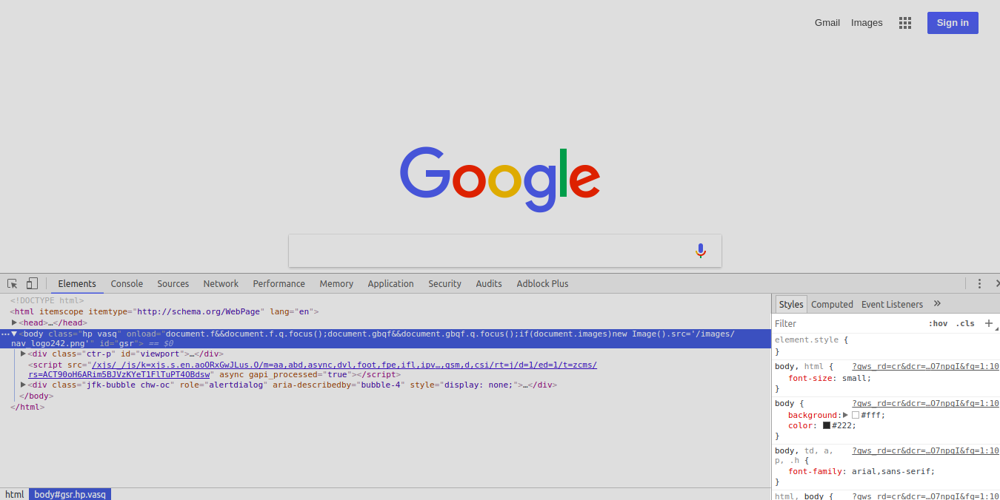

# CSS, the language of web design

## Introduction

* Just like we did with HTML, let's jump back to [google.com](www.google.com) and open Chrome Dev Tools. This time around, we'll be looking at the styles section



---

## What's CSS?

* CSS stands for Cascading Style Sheets
* CSS describes *how* the browser should display elements on a laptop screen, a smartphone screen, a piece of paper or other media


1. a CSS rule: consists of a selector and a declaration block
2. 2 CSS selector: points to the HTML element we want to style
3. a CSS declaration block: contains one or more declarations separated by semicolons
4. a CSS declaration: Each declaration includes a CSS property name and a value, separated by a colon

---

## Hello CSS

In the following example, we are setting the font size of all `h1` elements on the page to 28 pixels:

```css
h1 {
  font-size: 28px;
}
```
