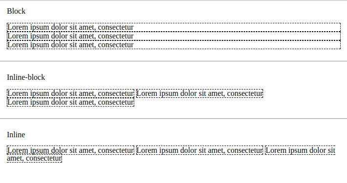

# CSS properties

## Colors in CSS

* A color value in CSS can be specified by:
  * a valid color name. e.g. `red`, `white`, `lightgrey`...*
  * an RGB value. e.g. `rgb(0, 119, 13)`
  * a hexadecimal value. e.g. `#fff`, `#15f023`
* A color is a combination of three RGB values (Red, Green, Blue). Every one of the the three values ranges from 0 to 255
* These are examples of properties that use color values:

| Property | Description |
| --- | --- |
| `color` | the color of the text of the element |
| `background-color` | the background color of the element |

---

## `display`

* All element on a webpage are in the form of a rectangle
* The display CSS property specifies the type of rendering box used for an element
* There are 3 main box formats in CSS:



### `display:block`

* The element will take as much horizontal space as possible
* We can change the width an height of the element
* examples of elements that have `display: block` by default: `p`, `h1`..`h6`, `hr`, `li`

### `display: inline-block`

* The element will take as little horizontal space as possible
* The element will allow other inline elements to be on its sides
* We can change the width and height of the element
* The element can NOT break in the middle
* examples of elements that have `display: inline-block` by default: `img`, `button`, `input`

### `display: inline`

* The element will take as little horizontal space as possible
* The element will allow other inline elements to be on its sides
* We CANNOT change the width and height of the element
* The element can break in the middle
* examples of elements that have `display: inline` by default: `a`, `span`


### `display:none`

* Do not display the element at all
* This value is useful when we want e.g. to hide an element by default and only show it after a certain event happens
---

## Activity: Default displays

* What is the default display of the following tags?:
* Try it yourself and decide for every tag

| Tag | `div` | `p` | `ul` | `ol` | `li` | `h1`..`h6` | `hr` | `img` | `button` | `input` | `a` | `span`
| --- | --- | --- | --- | --- | --- | --- | --- | --- | --- | --- | --- | ---|
| Default `display` | | | | | | | | | | | |

---

## `width` and `height`

* We can set the width and the height of element using two properties: `width` and `height`
* the values of `width` and `height` are in the form of a number followed by a measure unit
* e.g:
  * `width: 15px;`: a width of 15 pixels
  * `width: 50%;`: a width of 50% of the parent element
  * `height: 100%`: a height equal to the height of the parent element

## `position`, `top`, `bottom`, `left` and `right`
* We can set the position of an element using the `position` property
* by default, all elements have `position: static`
* We can change the position relative to the default position like this:
  ```html
  <div style="position: relative; top: 10px; left: 50px;">
    Some random text
  </div>
  ```
* other values of the `position` property:
  <iframe
    src="https://interactive-examples.mdn.mozilla.net/pages/css/position.html"
    class="live-sample-frame example-outcome-frame"
    width="1200"
    height="300"
    id="frame_position"
    style="max-width: 100%;"
    frameborder="0">
  </iframe>

---

## `font-size`
* The `font-size` property sets the size of the text of the element
* e.g `font-size: 14px;`, `font-size: normal;`...

---

## `font-weight`
* The `font-weight` property sets the boldness of the text of the element
* e.g `font-weight: normal`, `font-weight: bold`...

---

## `text-align`
* The `text-align` property sets the alignment of the text inside the element:
  * `text-align: center;` centers the text
  * `text-align: right;` right-aligns the text
  * `text-align: left;` left-aligns the text
