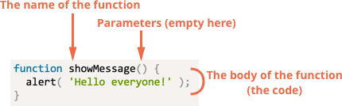

# Functions

Quite often we need to do a similar action in many places of the script.

For example, we need to show a nice-looking message when a visitor:
  - logs in.
  - logs out.
  - update profile informations.

Functions are the main **“building blocks”** of the program.

They allow the code to be called many times without repetition.

## Function Declaration

To create a function we can use a function declaration.

```javascript
function showMessage() {
  alert( 'Hello everyone!' );
}
```

<p align="center">
  
</p>

Our new function can be called by its name: **showMessage()**.

```javascript
function showMessage() {
  alert( 'Hello everyone!' );
}

showMessage();
showMessage();
```

## Parameters

* We can pass any data to functions using parameters (also called function arguments) .

```javascript
function showMessage(from, text) { // arguments: from, text
  alert(from + ': ' + text);
}

showMessage('Ann', 'Hello!'); // Ann: Hello! (*)
showMessage('Ann', "What's up?"); // Ann: What's up? (**)
```

## Returning a value

A function can return a value back as the result.

```javascript
function sum(a, b) {
  return a + b;
}

let result = sum(1, 2);
alert( result ); // 3
```

* The **return** can be in any place of the function.

* When the execution reaches **return**, the function stops, and the value is returned

**A function without a return, returns undefined**

```javascript
function sum(a, b) {
  alert(a + b);
}

alert( sum(1,2) === undefined ); // true
```

## Local variables

A variable declared inside a function is only visible inside that function.

```javascript
function showMessage() {
  let message = "Hello, I'm JavaScript!"; // local variable

  alert( message );
}

showMessage(); // Hello, I'm JavaScript!

alert( message ); // <-- Error! The variable is local to the function
```

## Outer variable

A function can access an outer variable as well:

```javascript
let userName = 'John';

function showMessage() {
  let message = 'Hello, ' + userName;
  alert(message);
}

showMessage(); // Hello, John
```

* The function has full access to the outer variable.

* It can modify it as well.

```javascript
let userName = 'John';

function showMessage() {
  userName = "Bob"; // (1) changed the outer variable

  let message = 'Hello, ' + userName;
  alert(message);
}

alert( userName ); // John before the function call

showMessage();

alert( userName ); // Bob, the value was modified by the function
```

## Exercises

1. Write a function **isEven** that check if a gien value is even

2. Write a function **test** that tests the previous function and return true if all tests passed, false otherwise

```javascript
function isEvent(n) { ... }
function test() {
  // check if isEvent works as expected
  // return "passed"
  // else return "failed"
}
```

3. Write a function **range** that takes two arguments *start* and *end*, and returns an array of values in between.

```javascript
function range(s, e) { ... }
let values = range(1, 5) // -> values = [1, 2, 3, 4]
```
