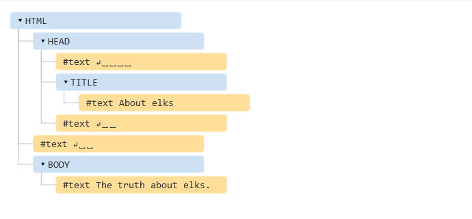
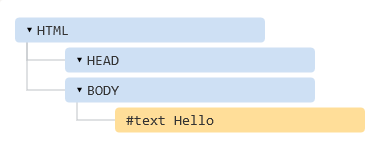
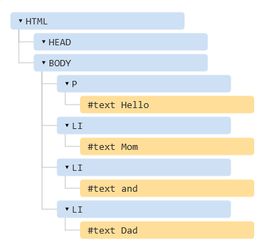

## DOM tree

The backbone of an HTML document is tags.

According to Document Object Model (DOM), every HTML-tag is an object. Nested tags are called “children” of the enclosing one.

The text inside a tag it is an object as well.

All these objects are accessible using JavaScript.

## An example of DOM

For instance, let’s explore the DOM for this document:

```JavaScript
<!DOCTYPE HTML>
<html>
<head>
  <title>About elks</title>
</head>
<body>
  The truth about elks.
</body>
</html>
```

The DOM represents HTML as a tree structure of tags. Here’s how it looks:

<p align="center">
  
</p>
On the picture above, you can click on element nodes and their children will open/collapse.

Tags are called element nodes (or just elements). Nested tags become children of the enclosing ones. As a result we have a tree of elements: `<html>` is at the root, then `<head>` and `<body>` are its children etc.

The text inside elements forms text nodes, labelled as `#text`. A text node contains only a string. It may not have children and is always a leaf of the tree.

For instance, the `<title>` tag has the text "About elks".

Please note the special characters in text nodes:

* a newline: `↵` (in JavaScript known as `\n`)
* a space: `␣`

## Autocorrection

If the browser encounters malformed HTML, it automatically corrects it when making DOM.

For instance, the top tag is always `<html>`. Even if it doesn’t exist in the document – it will be in DOM, the browser will create it. The same about `<body>`.

As an example, if the HTML file is a single word "Hello", the browser will wrap it into `<html>` and `<body>`, add the required `<head>`, and the DOM will be:

<p align="center" style="margin-top:25px">
  
</p>

While generating DOM, browser automatically processes errors in the document, closes tags and so on.

Such an “invalid” document:

```html
<p>Hello
<li>Mom
<li>and
<li>Dad
```

…Will become a normal DOM, as the browser read tags and restores the missing parts:

<p align="center" style="margin-top:25px">
  
</p>

## Summary

An HTML/XML document is represented inside the browser as the DOM tree.

* Tags become element nodes and form the structure.

* Text becomes text nodes.

* …etc, everything in HTML has its place in DOM, even comments.

We can use developer tools to inspect DOM and modify it manually.
