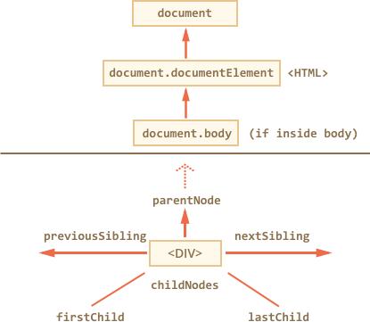

## Walking the DOM

DOM allows to do anything with elements and their contents, but first we need to reach the corresponding DOM object, get it into a variable, and then we are able to modify it.

All operations on DOM start with the document object. From it we can access any node.

Here’s a picture of links that allow to travel between DOM nodes:

<p align="center">
  
</p>

## On top: documentElement and body

The topmost tree nodes are available directly as document properties:

`<html>` = document.documentElement
The topmost document node is document.documentElement. That’s DOM node of `<html>` tag.

`<body>` = document.body
Another widely used DOM node is the `<body>` element – document.body.

`<head>` = document.head
The `<head>` tag is available as document.head.

## Children: childNodes, firstChild, lastChild

There are two terms that we’ll use from now on:

* `Child nodes` (or children) – elements that are direct children. In other words, they are nested exactly in the given one. For instance, `<head>` and `<body>` are children of `<html>` element.

* `Descendants` – all elements that are nested in the given one, including children, their children and so on.

For instance, here `<body>` has children `<div>` and `<ul>` (and few blank text nodes):

```html
<html>
<body>
  <div>Begin</div>

  <ul>
    <li>
      <b>Information</b>
    </li>
  </ul>
</body>
</html>
```
…And if we ask for all descendants of `<body>`, then we get direct children `<div>`, `<ul>` and also more nested elements like `<li>` (being a child of `<ul>`) and `<b>` (being a child of `<li>`) – the entire subtree.

The `childNodes` collection provides access to all child nodes, including text nodes.

The example below shows children of `document.body`:

```html
<html>
<body>
  <div>Begin</div>

  <ul>
    <li>Information</li>
  </ul>

  <div>End</div>

  <script>
    for (let i = 0; i < document.body.childNodes.length; i++) {
      alert( document.body.childNodes[i] ); // Text, DIV, Text, UL, ..., SCRIPT
    }
  </script>
  ...more stuff...
</body>
</html>
```

Please note an interesting detail here. If we run the example above, the last element shown is `<script>`. In fact, the document has more stuff below, but at the moment of the script execution the browser did not read it yet, so the script doesn’t see it.

Properties `firstChild` and `lastChild` give fast access to the first and last children.

They are just shorthands. If there exist child nodes, then the following is always true:

```JavaScript
elem.childNodes[0] === elem.firstChild
elem.childNodes[elem.childNodes.length - 1] === elem.lastChild
```

There’s also a special function `elem.hasChildNodes()` to check whether there are any child nodes

## Siblings and the parent

Siblings are nodes that are children of the same parent. For instance, `<head>` and `<body>` are siblings:

* `<body>` is said to be the “next” or “right” sibling of `<head>`,

* `<head>` is said to be the “previous” or “left” sibling of `<body>`.

The parent is available as `parentNode`.

The next node in the same parent (next sibling) is `nextSibling`, and the previous one is `previousSibling`.

For instance:

```html
<html><head></head><body><script>
  // HTML is "dense" to evade extra "blank" text nodes.

  // parent of <body> is <html>
  alert( document.body.parentNode === document.documentElement ); // true

  // after <head> goes <body>
  alert( document.head.nextSibling ); // HTMLBodyElement

  // before <body> goes <head>
  alert( document.body.previousSibling ); // HTMLHeadElement
</script></body></html>
```
## More links: tables

Till now we described the basic navigation properties.

Certain types of DOM elements may provide additional properties, specific to their type, for convenience.

Tables are a great example and important particular case of that.

`<table>` element supports (in addition to the given above) these properties:

* `table.rows` – the collection of `<tr>` elements of the table.

* `table.caption`/`tHead`/`tFoot` – references to elements `<caption>`, `<thead>`, `<tfoot>`.

* `table.tBodies` – the collection of `<tbody>` elements (can be many according to the standard).

`<thead>`, `<tfoot>`, `<tbody>` elements provide the rows property:

* `tbody.rows` – the collection of `<tr>` inside.

`<tr>`:

* `tr.cells` – the collection of `<td>` and `<th>` cells inside the given `<tr>`.

* `tr.sectionRowIndex` – the number of the given `<tr>` inside the enclosing `<thead>`/`<tbody>`.

* `tr.rowIndex` – the number of the `<tr>` in the table.

`<td>` and `<th>`:

`td.cellIndex` – the number of the cell inside the enclosing `<tr>`.

An example of usage:

```javascript
<table id="table">
  <tr>
    <td>one</td><td>two</td>
  </tr>
  <tr>
    <td>three</td><td>four</td>
  </tr>
</table>

<script>
  // get the content of the first row, second cell
  alert( table.rows[0].cells[1].innerHTML ) // "two"
</script>
```
## Summary

Given a DOM node, we can go to its immediate neighbours using navigation properties.

There are two main sets of them:

* For all nodes: `parentNode`, `childNodes`, `firstChild`, `lastChild`, `previousSibling`, `nextSibling`.

* For element nodes only: `parentElement`, `children`, `firstElementChild`, `lastElementChild`, `previousElementSibling`, `nextElementSibling`.

Some types of DOM elements, e.g. tables, provide additional properties and collections to access their content.

## Active learning

**DOM children**

For the page:

```html
<html>
<body>
  <div>Users:</div>
  <ul>
    <li>John</li>
    <li>Pete</li>
  </ul>
</body>
</html>
```
**The sibling question**

If elem – is an arbitrary DOM element node…

* Is it true that `elem.lastChild.nextSibling` is always `null`?

* Is it true that elem.children[0].previousSibling is always null ?

**Select all diagonal cells**

Write the code to paint all diagonal table cells in red.

You’ll need to get all diagonal `<td>` from the `<table>` and paint them using the code:

```javascript
// td should be the reference to the table cell
td.style.backgroundColor = 'red';
```

[Open the sandbox for the task.](http://plnkr.co/edit/KqjpnZ6j8DIuwW1fJX7s?p=preview)
