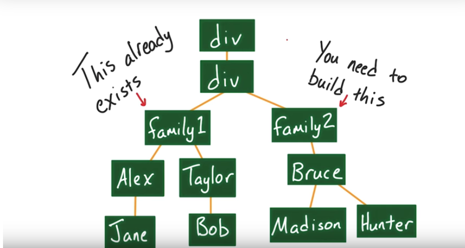

## What's jQuery

>	jQuery is a fast, small, and feature-rich **JavaScript library**. It makes things like HTML document traversal and **manipulation**, **event** handling, animation, and **Ajax** much simpler with an easy-to-use API that works across a **multitude of browsers**. – *jQuery docs*

## Understanding jQuery

```html
<!DOCTYPE html>
<html lang="en">

	<body>
		<!-- jQuery will change this -->
		<a href=""></a>
		<!-- to this <a href="http://www.jquery.com">link to jQuery's offficial website</a> -->
		<script src="https://code.jquery.com/jquery-3.3.0.js"
		></script>
		<script>
			$('a')
				.text('link to jQuery\'s offficial website')
				.attr('href', 'http://www.jquery.com')

			console.log($('a').text())
		</script>
	</body>
</html>
```

* As you can see jQuery is based on few simple concepts:
	1. **Select** a target element(s)
	2. **Call methods** on target elements
	3. You can **chain** method calls
	4. Methods can act as both **getters** and **setters**:
		* Getter: if you call it without parameters `.text()`
		* Setter: if you call it with parameters `.text('')`

## Activity: play around with DOM

> Try doing using only google for help. If you get stuck, you can have a quick glance at the hints below.

1. Fork this <a href="https://codepen.io/ghsamm/pen/xpMaYq">code pen</a>
* Remove the class `featured`
* Add `featured` class to main-article siblings.
* Add an `href` property to the first anchor tag.
* Set the `font-size` to `20px` for all paragraphs
* Change the heading to `Hello world again`
* Remove the last item in the list.
* Each time the user clicks the "Again" button, add the word " again" to the header

	Hints: `next`, `prev`, `remove`, `click`, `last`, `css`, `first`, `toggleClass`, `val`, `attr`, `text`

## Building a DOM tree

Try to build the following DOM tree

<p align="center">
	
</p>
