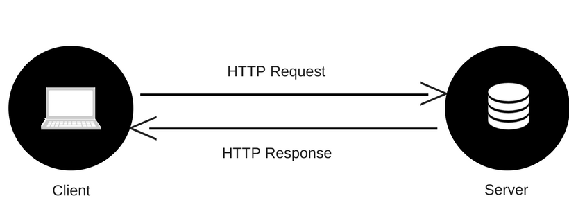

# An overview of HTTP

* A protocol is a set of rules and guidelines for transmitting data between electronic devices, such as computers.

* HTTP is a **communication protocol** that is used to communicate between machines.

* The HTTP protocol is a request/response protocol based on the client/server architecture.

* The HTTP **client** sends a request to the server.

* The HTTP **server** responds with data or an error.

## HTTP Messages

There are two types of HTTP messages, requests and responses, each with its own format.

**Requests**

Requests consists of the following elements:

* An HTTP method, usually a verb like `GET`, `POST`, `UPDATE` and `DELETE` that defines the operation the client wants to perform.

* The **path** of the requested resource. For example:

	* `myapi.com/users` to access users data
	* `myapi.com/songs` to access songs data
	* `myapi.com/books` to access books data

* The version of the HTTP protocol.

* Optional headers that convey more information for the servers.

**Responses**

Responses consist of the following elements:

* The version of the HTTP protocol they follow.

* A status code, indicating if the request has been successful, or not, and why.

* A status message, a non-authoritative short description of the status code.

* HTTP headers, like those for requests.

* Optionally, a body containing the fetched resource.

## Activity

1. What is the difference between HTTP and HTTPS ?

2. What are the types of media that can be transferred over HTTP ?

3. What are the most used HTTP methods ? When are they used ?

4. What are the 5 groups of HTTP status codes ?
