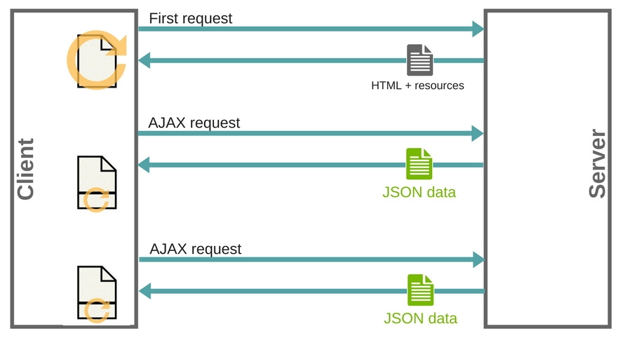

# Fetching data from the server

## Introduction

* The web is based on communication between different machines
* There are two types of machines on the web:
	* The **client**: requests resources (a website, an image, JSON data...)
	* The **server**: responds with resources or error
* The communication is always **initiated by the client**: the server can only send resources to a client in response to a client request
* In modern websites and web apps, the communication happens like this:
	1. The initial request gets all needed **resources**: HTML + CSS + JS + images ...
	* Any further request is just for **data**
	* The **client** is responsible for **handling that data**

## Benefits of the AJAX model

* Page updates are a lot quicker and you don't have to wait for the page to refresh, meaning that the site feels faster and more responsive.

* Less data is downloaded on each update, meaning less wasted bandwidth. This may not be such a big issue on a desktop on a broadband connection, but it's a major issue on mobile devices.

## Ajax with jQuery

Read the following articles

1. <a href="https://learn.jquery.com/ajax/">What's ajax</a>

2. <a href="https://learn.jquery.com/ajax/key-concepts/">Key concepts</a>

3. <a href="https://learn.jquery.com/ajax/jquery-ajax-methods/">jQuery's Ajax related methods</a>

### Active learning

Try to re-do the previous ajax example using jQuery's ajax method.
