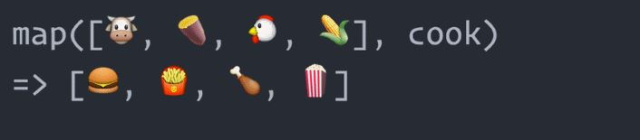

## Activity: plus one to all students! Imperative

* Say we have a list of students grades and we want everyone to get +1
* Create a function `plusOneToAllStudentsImperative` that loops over an array `students` and increments them all by `1`
* Remember to handle edge cases

## Activity: plus one to all students! Declarative
* Now what if we want to create a new function that adds 2 rather than 1 ? We would have to write a new function and copy much of the code of `plusOneToAllStudents`. No code reuse here. That's so WET!
* No worries. FP can help you here. Look at this picture:


* Here is the idea:
  1. Create a function `plusOne` that:
    * takes one input `x`
    * returns `x + 1`
  2. Create a function `max20` that
    * takes one input `x`
    * returns
      * `20` if `x` is greater than 20
      * `x` otherwise
  3. Create a function `map` that:
    * takes as input an array `arr` and a function `mapFn`
    * apply `mapFn` to all elements of `arr`, one by one
    * returns an array `mappedArr` containing all the results of the previous step
  4. Create a function `plusOneToAllStudentsFP` that
    * uses `plusOne`, `max20` and `map`
    * takes as input an array of numbers `grades`
    * returns `finalGrades` as expected
  5. What if we want to add `2` instead of `1` now ? Would that be as hard ?


## Array.prototype.map

* If you finished the previous activity, congratulations! You have reimplemented `Array.prototype.map`
* `Array.prototype.map` is a higher order function that
  1. takes as input a function `mapFn`
  2. apply `mapFn` to all elements of the calling array.
  3. creates a new array `mappedArr` with the results from step 2
  4. returns `mappedArray`
* `map` passes your callback `mapFn` three arguments:
  1. The *current item*
  * The *current index*
  * The *calling array*
* We use the `map` function to modify every element in the array in exactly the same way



## Exercices

1.

* Use the function `.map()` to return an array `integers` with absolute values of their values.

Input :

  ```javascript
  var
    integers = [1,-0,9,-8,3]
  ```

Output :

```javascript
  console.log(integers);  //[1,0,9,8,3]
```

2.

* Multiply using `.map()` an array of numbers by their position in the array.

Input :

  ```javascript
  var
    numbers = [1,2,3,4]
  ```
Output :

```javascript
  console.log(numbers)  //24
```

3.

* Split the sting.

* Map the string to capitalize the first letter only.

* Join the string words.

Input :

  ```javascript
  var
    str = 'hello world how ya doing?';
  ```

Output :

```javascript
  str = 'Hello World How Ya Doing?';
```
