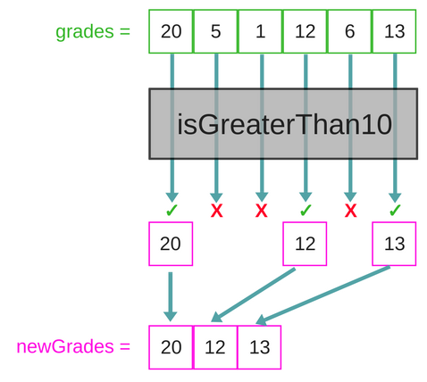

## Activity: who passes the test ?

1. Write a function `passTheExam` that
  * takes an array of numbers `grades`
  * returns a new array with only the grades greater than 10
* Change the condition of the graduation to become "greater than 12"
* The shape of the array has changed, it looks like this now:

  ```javascript
  let grades = [
    {name: 'Student One', grade: 15},
    {name: 'Student Two', grade: 2},
    {name: 'Student Three', grade: 13}
  ]
  ```
  Rewrite your function to match the new version

## Activity: who passes the test ? FP style

1. Try rewriting the `passTheExam` function using functional style.
  * To do this, you need to figure out what functionality can be reused across versions
  * If you need a hint, here is one
  

## Array.prototype.filter

* If you finished the previous acitivity, congratulations! You have reimplemented `Array.prototype.filter`
* `Array.prototype.filter` creates a new array with all elements that pass the test implemented by the provided function.
* `Array.prototype.filter` is a higher order function that:
  1. takes as input a function `testFn`
  * apply `testFn` to all elements of the calling array
  * creates a new array `filteredArr` that has all elements from the calling array that pass the `testFn` (in other words, the elements that return true when passed to `testFn`)
* `filter` passes your callback `testFn` three arguments:
  1. The *current item*
  2. The *current index*
  3. The *calling array*
* We use the `filter` function whenever we want to extract a sub-array based on a certain criteria


## Exercices

1.

* Remove all negative numbers

Input :

  ```javascript
  var
    tab = [-2,-1,0,1,2];
  ```

Output :

```javascript
  console.log(tab);  //[0,1,2]
```

2.

* Remove random objects from an array

Input :

  ```javascript
  var
    myarray = [1,2,3,4]
  ```

Output :

```javascript
  console.log(myarray)  //[1] //[1,4]
```
