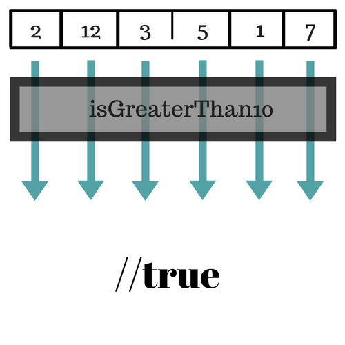
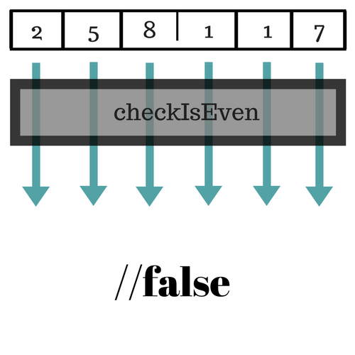

# Some and Every

## Array.prototype.some

* The `some()` method tests whether **at least one** element in the array passes the test implemented by the provided function.
* `some()` executes the `callback` function once for each element present in the array until it finds one where `callback` returns a truthy value.
* If such an element is found, `some()` immediately returns `true`.
* `some()` does not mutate the array on which it is called.

## Activity: Element bigger than 10

* Say we have an array that contains some integers
* Create a function `isGreaterThan10()` that loops over an array `integers` and tests whether any element in the array is bigger than 10.



* If you finished the previous activity, congratulations! You have reimplemented `Array.prototype.some`

```javascript
function isBiggerThan10(element, index, array) {
  return element > 10;
}

[2, 5, 8, 1, 4].some(isBiggerThan10);  // false
[12, 5, 8, 1, 4].some(isBiggerThan10); // true
```

## Array.prototype.every

* The `every` method tests whether **all** elements in the array pass the test implemented by the provided function.
* `every()` executes the `callback` function once for each element present in the array until it finds one where `callback` returns a falsy value.
* If such an element is found, the `every` method immediately returns `false`.
* `every()` does not mutate the array on which it is called.

## Activity: Elements are even

* Say we have an array that contains some integers
* Create a function `checkIfEven()` that loops over an array `integers` and tests whether all elements in the array are even.



* If you finished the previous activity, congratulations! You have reimplemented `Array.prototype.every`

```javascript
var
  myarray = [2, 5, 8, 1, 4, 7]

var isEven = numbers.every(function (el) {
    return el % 2 == 0;
});
console.log(isEven); // false
```
