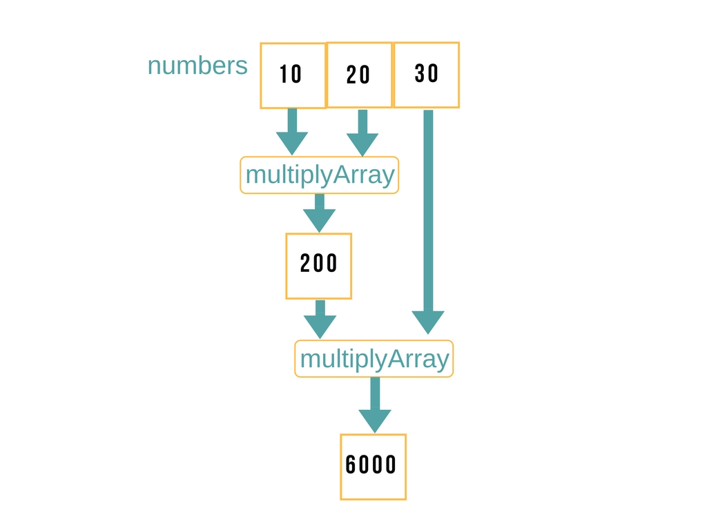

# Activity: play with an Array
## 1.imperative
 - we have an array of numbres and we want to double all the numbers.
 - create a function doubleOfArray that loops over the array.

## 2. Declarative

* Here is the idea:
  1. Create a function `multiply` that:
    * takes one input `x , y`
    * returns `x * y`
  2. Create a function `result` that:
    * takes as input an array `arr` and a function `multiply`
    * apply `multiply` to a `arr`

## Array.prototype.reduce

* If you finished the previous activity, congratulations! You have reimplemented `Array.prototype.reduce`
* `Array.prototype.reduce` is a higher order function that
  1. takes as input a function `array`,`fuction`, `initial start`
  2. apply `multiply` to the calling array.
  3. returns `result`
* `reduce` passes your callback `multiply`

# Exercice
## find the largest number
we have an array numbers = [1,2,3,4] we want to return the largest number `4`
  1. Write a function that takes two numbers ` a , y `
  2. return the largest number
