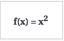

# Functions and reliable systems

As a programmer, your job is to make reliable systems.

>	A realiable system; consistently performs according to its specifications

>	A system that work correctly all the time.

## What is a system?

A system is "a set of interconnected <strong>COMPONENTS</strong> that form a complex whole".

What are the components of a small, well-built program?

The single most-useful <strong>COMPONENT</strong> for you, as a beginning programmer, is a <strong>FUNCTION</strong>.

Components are ideally:

* Completely reliable
* Easy to understand
* Easy to re-use
* Easy to connect with other components

Well-written functions satisfy the above criteria.

## What is a function?

Functions map INPUT to OUTPUT.

This is a programming function:

```javascript
function square(x) {
	return x * x;
}
```

>	This function maps all valid values of `x` to their squared values. 

However this is also a programming function:

```javascript
function square(x) {
	console.log(x * x);
}
```

This function does nothing at all, from the perspective of the caller. There is no <strong>return value</strong> (it returns `undefined`, by default). Instead, there is a side effect -- a value is printed to the console, unbeknownst to the caller. 

That's actually not great, because it makes the system more mysterious, less predictable.

Let's look at the world of mathematical functions. Programming functions derive directly from mathematical functions, and looking at them briefly can help us write better programs. 

## What's a mathematical function?

A mathematical function maps a <strong>"domain"</strong> to a <strong>"range"</strong>. It just means mapping one set of values to another set of values.

For this function...

<p align="center">
	
</p>

... the mapping looks like this 

<p align="center">
	
</p>

Here are some important characteristics to note about mathematical functions that make them useful to consider when writing programming functions.

## Mathematical functions are RELIABLE

Given some INPUT, a valid mathematical function will only map to one OUTPUT.

No matter how many times you supply that input, a given function will keep producing the same output.

That makes the function reliable and easy to reason about. 

## Mathematical functions are SELF-CONTAINED

Math functions only accept INPUT.

There is no concept of GLOBAL STATE. They do not refer to values other than the input.

This aspect of being self-contained means that they are tidy, predictable black boxes. A change in some value outside of the function will not have an impact on the working of the function. 

## Mathematical functions have no SIDE EFFECTS

Math functions only evaluate to their OUTPUT.

Again there is no concept of GLOBAL STATE. They do not affect values outside themselves.

This aspect of having no side effects means that they are tidy, predictable black boxes The workings of the function will not randomly impact values outside the function.

## Mathematical functions DO ONE THING

Because math functions are self-contained and have no side effects, they can be understood as doing only one thing. 

They map INPUT to OUTPUT in some predetermined, completely reliable way. The nature and purpose of that mapping might be quite complex, but the function only performs that mapping. 

## How this applies to programming

The features described above regarding mathematical functions are very useful in the programming world.

Composing a system from programming functions that are written to behave similarly to mathematical functions means it is a lot easier to reason about that system.

* There will be fewer bugs.

* It will be easier to debug the problems that do arise.

* It will be easier to understand and explain the system to others.

* It will be easier to safely extend it with new functionality.

## This is true even in small programs

Bugs, confusion, and difficulty of extension all happen even in small programs.

Decomposing your problem solution into a system of small, well-named, single-purpose functions with no side effects will reap benefits even at a small scale.
