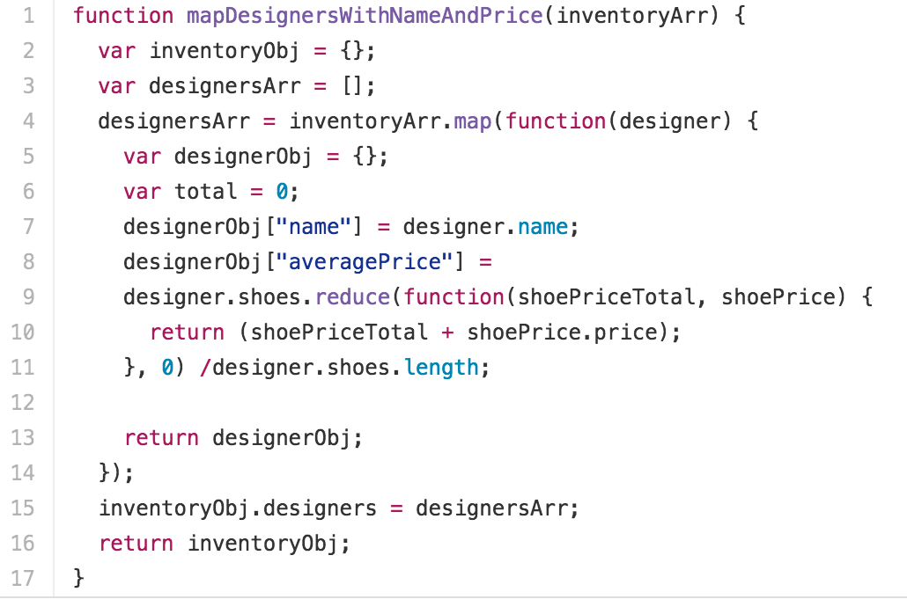
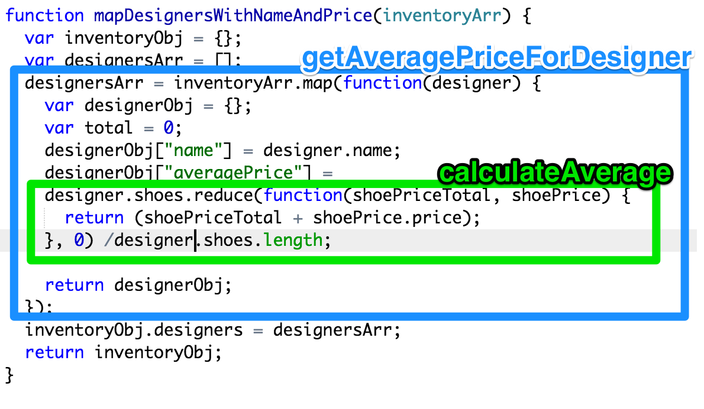
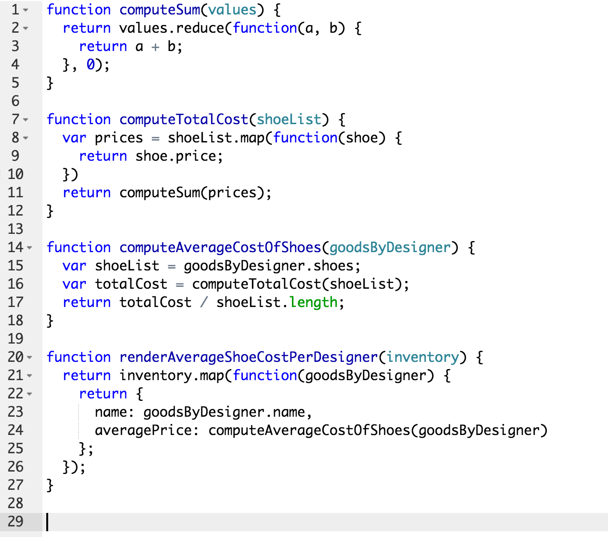
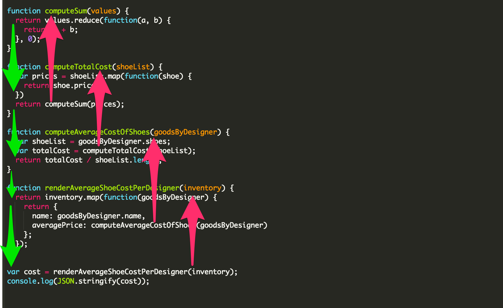

# Clean Coding

Clean code tells the code reader a story about what it is doing.

It is self-describing and transparent.

To illustrate this, let's look at a bad example and turn it into a good example.

## Example of unclean vs clean coding

Let's take a look at a typical beginning programmer's approach to a specific problem.

Then we will consider what's wrong with it, and how it could be improved.

<strong>The problem statement</strong>

```javascript
var inventory = [
   {
     name: 'Brunello Cucinelli',
     shoes: [
       {name: 'tasselled black low-top lace-up', price: 1000},
       {name: 'tasselled green low-top lace-up', price: 1100},
       {name: 'plain beige suede moccasin', price: 950},
       {name: 'plain olive suede moccasin', price: 1050}
     ]
   },
   {
     name: 'Gucci',
     shoes: [
       {name: 'red leather laced sneakers', price: 800},
      {name: 'black leather laced sneakers', price: 900}
     ]
   }
 ];
```

Now output the average cost of all shoes per designer in this format:

```javascript
 var expected = {
   'designers': [
     {
       'name': 'Brunello Cucinelli',
       'averagePrice': 1025
     },
     {
       'name': 'Gucci',
       'averagePrice': 850
     }
   ]
 };
```

<strong>The beginning programmer's solution</strong>

Given the above problem statement, this is a real example of code produced by a beginning programmer: 

<p align="center">
	
</p>

<strong>What's wrong with this solution?</strong>

Simply put, the above solution is hard to read.

There is too much going on in the function body. It would be a lot easier to understand if we factored out a couple of helper functions that each did only one small thing.

Upon seeing the above code, some refactoring like this is what comes to a seasoned programmer's mind: 

<p align="center">
	
</p>

<strong>A complete, cleaner solution</strong>

Let's take the basic idea in the sketch above, and flesh it out into a complete solution. We won't retain the exact names, but we'll retain the basic idea.

<p align="center">
	
</p>

<strong>Why this is better</strong>

Your code should tell a STORY.

A story has a BEGINNING, a MIDDLE, and an END.

A story FLOWS smoothly.

In a good story, it is easy to keep track of what's going on at any given moment (the CURRENT STATE).

Here's a visualization that illustrates the "story" flow being told by the code above:

<p align="center">
	
</p>

## Ok, but how do I get the code to tell a story, exactly?

* Assemble your solution from small, single-purpose functions that have no side effects.

* Aim for a simple, clear flow of data from small function to small function.

* Think in terms of inputs and outputs at every level of your system. Each small function transforms its input into an output.

* Use precise, self-describing names for your functions and variables.

* Functions in particular should be named <strong>"verbObject"</strong>, like
`getEntity`, `renderList` or `calculateAverage`. This emphasizes the transformation of input into output.


