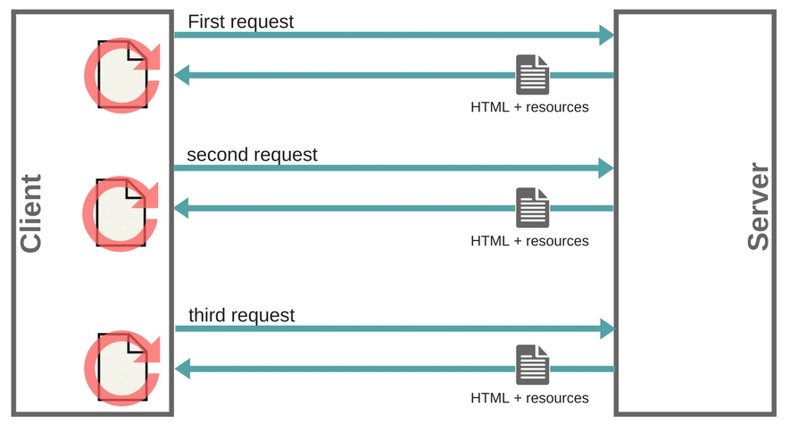

# Single Page Applications

## History of the web
  * Before AJAX:
    1. The client sends a request to the server
    2. The server responds with an HTML page containing all necessary resources(scripts, CSS, images...)
    3. When the user clicks a link, the browser refreshes the page and **reloads all the resources from the server**
  * After AJAX:
    1. (same)
    2. (same)
    3. When the user clicks a link, the browser **does not refresh the page** and **only loads new data from the server**

## Definition: SPA

  * A Single Page Application is a web application that requires only a **single HTML page** to be loaded.
  * The web app interacts with the user by **modifying the current page** rather than loading entire new pages from a server

## Multi Page vs. Single Page Apps

<table border style="text-align: center; border-collapse: collapse">
  <tr>
    <td>Multi Page App</td>
    <td>Single Page App</td>
  </tr>
  <tr>
    <td>  </td>
    <td>  </td>
  </tr>
</table>

## Benefits of SPAs

  * **Fast**: most resources (HTML + CSS + Scripts) are only loaded once. The browser only needs to request data from the server.
  * **Easy to develop**: Most of the logic of the app happens in the front-end. As opposed to the client-side architecture in which the server takes care of the logic part.
  * **Easy to debug**: You can watch network operations, investigate page elements and data associated with it.
  * **Multi-platform**: It’s easier to make a mobile application. The developer can reuse the same back-end code for web and mobile applications.

## Activity

1. Write down a list of 5 websites you use that are SPAs
2. Write down one website you use that is not an SPA
3. Find 2 downsides of using SPAs
4. Find 5 javascript frameworks/libraries that can allow us to build SPAs.
5. Which one is the most popular ? Which one is the most performant ?
