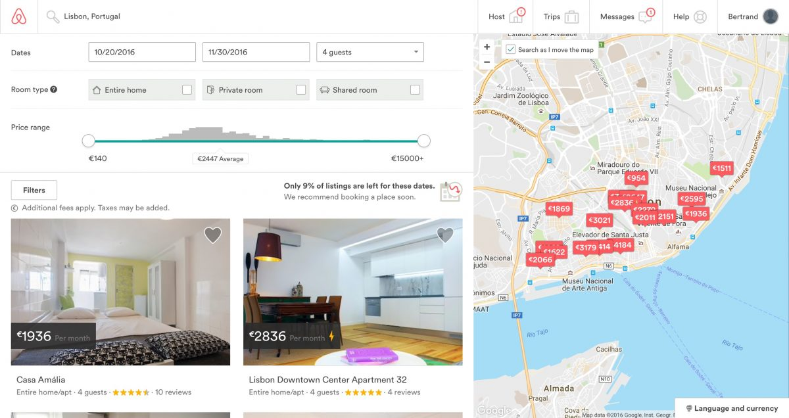

# React's architecture: Components

## 1. Composition

* Compose the app into many small components
* Components are just like HTML tags, except we can create our own
* Using components, we can divide our apps into smaller manageable pieces that are
  * **Easy** to understand
  * Do **one** thing very well
  * **Reusable**
  * Have **data** as input and **view** as output
* examples:
  * a `Map` component that takes as input a latitude and longitude and displays the corresponding location
  * a `FriendList` component that takes as input a JSON list of friend objects and displays it
  * a `Header` component that takes as input a JSON list of link objects and displays it

## Activity

1. Using a pen and a paper, compose the following screenshot into a **tree of components**
  * Remember the HTML activity ? This is similar, except you can name your components
  * Try to give you components meaningful names.
  * For example, use `MainFooter` and `SecondaryFooter` rather than `Footer1` and `Footer2`.
  * The purpose of this activity is to learn how to reuse components. Don't repeat yourself.
2. Associate each component with a possible **input and output**

### Example 1: Airbnb's home page

  

### Example 2: Airbnb's search page

  
