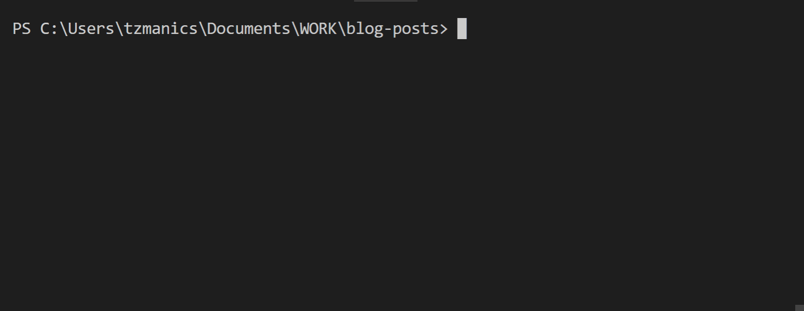
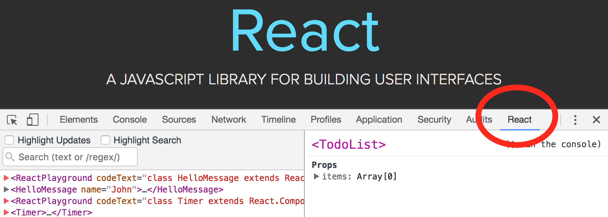

## It's easy to get started with

## Installation

  * Make sure that you have the latest version of Node on your machine.
  * create-react-app : The best way to start building a new React single page application.

```sh
npm install -g create-react-app
create-react-app my-app

cd my-app
npm start
```
<p align='center'>

</p>

<p align='center'>

</p>

## Quick start

<p align='center'>

</p>

## Adds React debugging tools to the Chrome Developer Tools.

* React Developer Tools is a Chrome DevTools extension for the open-source React JavaScript library. It allows you to inspect the React component hierarchies in the Chrome Developer Tools.

* [Chrome extension](https://chrome.google.com/webstore/detail/react-developer-tools/fmkadmapgofadopljbjfkapdkoienihi)
* [Firefox extension](https://addons.mozilla.org/fr/firefox/addon/react-devtools/)


