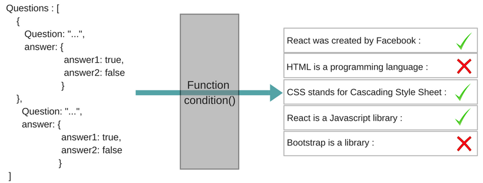

# Conditions

```javascript
import React, { Component } from 'react'

class People extends Component{
  constructor(props){
    super(props)
    this.state = {
      people: [
        {
          name: "Sirine",
          score: 62
        },
        {
          name: "Moez",
          score: 57
        },
        {
          name: "Jon Doe",
          score: 40
        },
      ]
    }

  }
  render(){
    return(
      <div>
        {
          this.state.people.map((p) => {
            return (
              <div>
                <h2>{ p.name }</h2>
                {
                  (p.score >= 50) &&
                  <h3>Pass</h3>
                }
                {
                  (p.score < 50) &&
                  <h3>Fail</h3>
                }
              </div>
            )
          })
        }
      </div>
    )
  }
}

export default People
```

### Exercise


