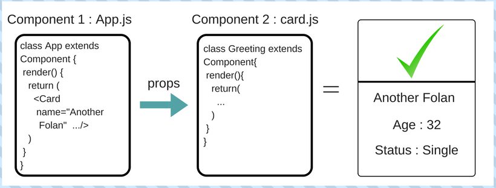

# Props

We can think of props as Component's Input: The parent component can pass values to the child component through props.

## Example: Greeting Component

// Greeting.js

```javascript
import React, { Component } from 'react'

class Greeting extends Component{
  render(){
    return(
      <h1>Hello {this.props.name}</h1>
    )
  }
}

export default Greeting
```

// App.js

```javascript
import React, { Component } from 'react'
import Greeting from './Greeting'

class App extends Component {
  render() {
    return (
      <Greeting name="Another Folan" />
    )
  }
}

export default App
```

## Exercise 1:
Create a Calculator Component which takes 2 inputs (through props) x and y and render (x+y).

```html
  <Calculator x={5} y={6} />
```

## Exercice 2:
* Create a VacancySign component that has a boolean prop `hasvacancy`. The component should render
a div with either the text "Vacancy" or "No Vacancy" depending on the prop.

* Create a Card Component which takes 3 inputs (through props) name, age and status and render a card contains all user informations.


