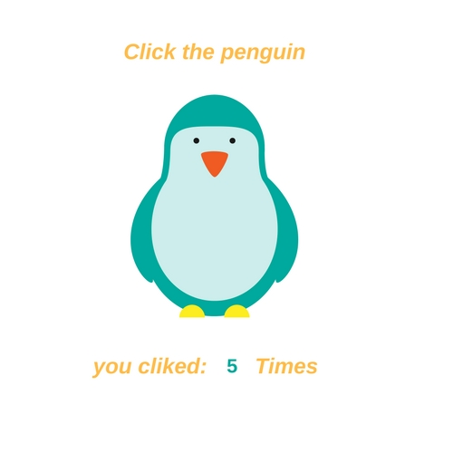
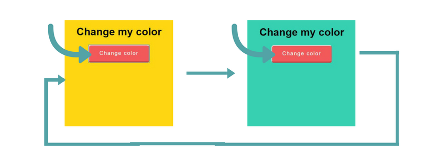

# State

* We can store a state of a component in `this.state` and for every change of this state, the component will be re-rendred.

* The state is initialized in the constructor then we can change it with the method `setState`.

## Example: Counter

```javascript
import React, { Component } from 'react'

class Counter extends Component{
  constructor(props){
      super(props)
      this.state = { // init state
        counter: 0
      }

      setInterval(() => {
        this.setState({ //change state
          counter: this.state.counter + 1
        })
      }, 1000)
  }

  render(){
    return(
      <div>
        <h1>Counter: {this.state.counter}</h1>
      </div>
    )
  }
}

export default Counter
```
## Exercice:
Create a Countdown component which takes number of seconds as input (through props) and render a countdown to 0.

## Exercice:
Create a Click component wich every time you click the penguin the state change +1 .



## User Story
* Inital your state to `0`
* write a function `clickpenguin` to change the state


## Exercise
* Everytime you click the button and "TADAAHH" the color changes.


