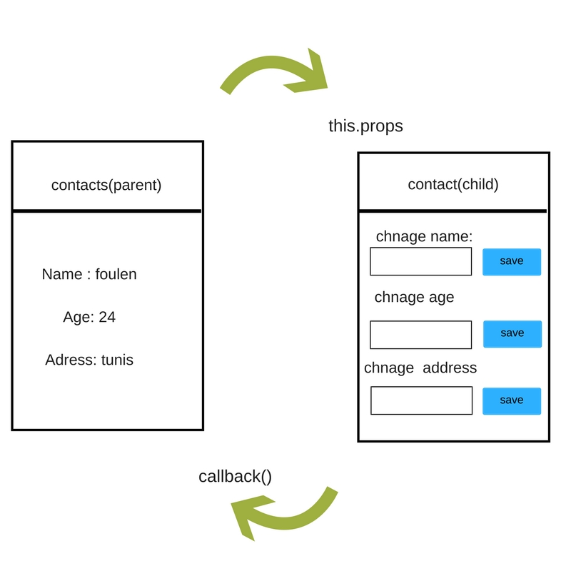

# Child to Parent — Use a callback

Let's suppose that we have data in child component that the parent needs access to, we can do the following:

1. Define a callback in the parent component which takes the `data` as a parameter.

2. Pass that `callback` as a prop to the child component (see below).

3. Call the callback using `this.props.callback` in the child and pass in the data as the argument.

4. Here’s what that might look like if we had data in `ToDoItem` that we need to access in `ToDoList`:

```javascript
class ToDoList extends React.Component {
  myCallback = (dataFromChild) => {
    this.setState({
      data: dataFromChild
    })
  },
  render() {
    return (
      <div>
        <ToDoItem callbackFromParent={this.myCallback}/>
      </div>
    );
  }
}
```
Now from within ToDoItem we can pass something to callbackFromParent:

```javascript
class ToDoItem extends React.Component{
    someFn = () => {
        this.props.callbackFromParent(listInfo);
    },
    render() {
        return(
          <div>
            ...
          </div>
        )
    }
}
```

here's an [Example](https://codepen.io/PiotrBerebecki/pen/dpRdKP) from codepen

## Activity:

We have a contact object we want to upadate his personal information.

### User Stories:

1- Create a parent component that has a contact object have 3 information:

  * `name ` : string
  * `age` : int
  * `address` : string

2-  Create a child component with 3 text inputs

3- create a callback function in the parent component call  `onchangeInformation`

4- Use the the callback function



