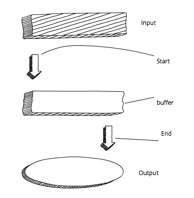

## HTTP Client with Core http

In web development we often want to make HTTP requests to other services, and Node provides a core module http to make such requests.

This module uses the event emitter pattern. The idea is that you get a small chunk of the overall response (usually a single line of the overall payload/body) during each data event.

You can process the data right away (preferred for large data) or save it all together in a buffer variable for future use once all the data has been received (preferred for JSON).

<p align='center'>
  
</p>

Take a look at the example in http-get-no-buff.js in which each new line (chunk) of the response is printed back to the terminal with console.log:

http-get-no-buff.js:

```JavaScript
const http = require('http')
const url = 'http://nodeprogram.com'
http.get(url, (response) => {
  response.on('data', (chunk) => {
    console.log(chunk.toString('utf8'))
  })
  response.on('end', () => {
    console.log('response has ended')
  })
}).on('error', (error) => {
  console.error(`Got error: ${error.message}`)
})
```

The result of running this script will be the home page HTML from http://nodeprogram.com. It might be hard to notice with a naked eye, but the result will be printed as the request is happening, not all at once in the end of the request.

If you want to wait for the entire response, simply create a new variable as a buffer variable (rawData) and save the chunks (parts of the response, usually lines in the payload/body) into it (rawData).

<p align='center'>
  
</p>

In http-get.js, all the chunks are saved into a buffer variable named rawData before being logged at the end:

```JavaScript
const http = require('http')
const url = 'http://nodeprogram.com'
http.get(url, (response) => {
  let rawData = ''
  response.on('data', (chunk) => {
    rawData += chunk
  })
  response.on('end', () => {
    console.log(rawData)
  })
}).on('error', (error) => {
  console.error(`Got error: ${error.message}`)
})
```

The result of running the script http-get.js will be the HTML of http://nodeprogram.com, but the output to the terminal (console.log(rawData)) will happen only at the end of the request when all the data has been received. Again, this might be hard to notice with a naked eye but it'll be obvious when processing large responses over 10Mb in size.
