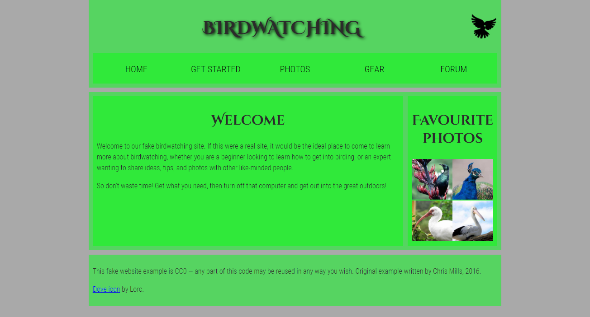

# Learning Objectives

To test knowledge of web page structures, and how to represent a prospective layout design in markup.

# Project brief

For this project, your task is to take the content for the homepage of a bird watching website and add structural elements to it so it can have a page layout applied to it. It needs to have:

 - A header spanning the full width of the site containing the main title for the page, the site logo, and the navigation menu. The title and logo appear side by side once styling is applied, and the navigation appears below those two items.
 - A main content area containing two columns — a main block to contain the welcome text, and a sidebar to contain image thumbnails.
 - A footer containing copyright information and credits.

You need to add a suitable wrapper for:

 - The header
 - The navigation menu
 - The main content
 - The welcome text
 - The image sidebar
 - The footer

You should also:

 - Apply the provided CSS to the page by adding another `<link>` element just below the existing one provided at the start.

## Resources

[Document and website structure](https://developer.mozilla.org/en-US/docs/Learn/HTML/Introduction_to_HTML/Document_and_website_structure)

# Result preview

	

