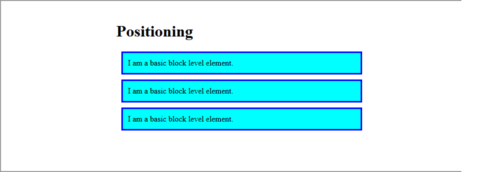

# Introduction to CSS layout

To give you an overview of CSS page layout techniques. Each technique can be learned in greater detail in subsequent chapters.

The page layout techniques we'll be covering in more detail in this module are:

1. Floats
2. Positioning
3. CSS tables
4. Flexbox

## Normal layout flow

Normal flow is how the browser lays out HTML pages by default when you do nothing to control page layout. Let's look at a quick HTML example:

```html
<p>I love my cat.</p>

<ul>
  <li>Buy cat food</li>
  <li>Exercise</li>
  <li>Cheer up friend</li>
</ul>

<p>The end!</p>
```


<div style="border: 1px dotted black; padding: 15px;">
	<p>I love my cat.</p>
	<ul>
	  <li>Buy cat food</li>
	  <li>Exercise</li>
	  <li>Cheer up friend</li>
	</ul>
	<p>The end!</p>
</div>

<br>

>	Note here how the HTML is displayed in the exact order in which it appears in the source code, with elements stacked up on top of one another — the first paragraph, followed by the unordered list, followed by the second paragraph.

Layout techniques tend to override this default behaviour, using:


* The `position` property — `static` is the default in normal flow, but you can cause elements to be laid out differently using other values, for example always fixed to the top left of the browser viewport.
* Floats — applying a `float` value such as `left` can cause block level elements to line up alongside one another rather than sit on top of one another
* The `display` property — standard values such as `block`, `inline` or `inline-block` can change how elements behave in normal flow (see Types of CSS boxes for more information), whereas uncommon or specialised values allow us to lay out elements in completely different ways using tools like Flexbox.

## Float

Floats is a technique that allows the elements to float to the left or right of one another, rather than the default of sitting on top of one another. The main uses of floats are to lay out columns and float text around an image.

The float property has four possible values:


`left` — floats the element to the left.
`right` — floats the element to the right.
`none` — specified no floating at all. This is the default value.
`inherit` — specifies that the value of the float property should be inherited from the parent element.

### Simple HTML example

Let's show how we can create a simple two column layout using floats. First, some HTML:

```html
<h1>2 column layout example</h1>
<div>
  <h2>First column</h2>
  <p> Lorem ipsum dolor sit amet, consectetur adipiscing elit. Nulla luctus aliquam dolor, eu lacinia lorem placerat vulputate. </p>
</div>

<div>
  <h2>Second column</h2>
  <p>Nam vulputate diam nec tempor bibendum. Donec luctus augue eget malesuada ultrices. Phasellus turpis est, posuere sit amet dapibus ut.</p>
</div>
```

<div style="border: 1px dotted black; padding: 15px">
<h1>2 column layout example</h1>
<div>
  <h2>First column</h2>
  <p> Lorem ipsum dolor sit amet, consectetur adipiscing elit. Nulla luctus aliquam dolor, eu lacinia lorem placerat vulputate. </p>
</div>

<div>
  <h2>Second column</h2>
  <p>Nam vulputate diam nec tempor bibendum. Donec luctus augue eget malesuada ultrices. Phasellus turpis est, posuere sit amet dapibus ut.</p>
</div>
</div>

<br>

<strong>Making the columns `float`</strong>
Let's change things — we instead want our two `<div>`s to sit side by side. To do this, we can use the following code.
```html
div:nth-of-type(1) {
  width: 48%;
  float: left;
}

div:nth-of-type(2) {
  width: 48%;
  float: right;
}
```

<br>

<h1>2 column layout example</h1>
<div style="width: 48%; float: left;">
  <h2>First column</h2>
  <p> Lorem ipsum dolor sit amet, consectetur adipiscing elit. Nulla luctus aliquam dolor, eu lacinia lorem placerat vulputate.
  </p>
</div>
<div style="width: 48%; float: right;">
  <h2>Second column</h2>
  <p>Nam vulputate diam nec tempor bibendum. Donec luctus augue eget malesuada ultrices. Phasellus turpis est, posuere sit amet dapibus ut.
  </p>
</div>

## Positioning techniques

Positioning allows you to move an element from it's original spot on the page to another spot with great accuracy.

There are four main types of positioning you should know about:


* `Static positioning` is the default that every element gets — it just means "put the element into it's normal position in the document layout flow — nothing special to see here".
* `Relative positioning` allows you to modify an element's position on the page, moving it relative to its position in normal flow — including making it overlap other elements on the page. This is useful for minor layout tweaks and design pinpointing.
* `Absolute positioning` moves an element completely out of the page's normal layout flow, like it is sitting on its own separate layer. From there, you can fix it in a position relative to the edges of the page's <html> element (or it's nearest positioned ancestor element). This is useful for creating complex layout effects such as tabbed boxes where different content panels sit on top of one another and are shown and hidden as desired, or information panels that sit off screen by default, but can be made to slide on screen using a control button.
* `Fixed positioning` is very similar to absolute positioning, except that it fixes an element relative to the browser viewport, not another element. This is useful for creating effects such as a persistent navigation menu that always stays in the same place on the screen as the rest of the content scrolls.

<strong>Simple positioning example</strong>

To provide familiarity with these page layout techniques, we'll show you a couple of quick examples. 

```html
<h1>Positioning</h1>

<p>I am a basic block level element.</p>
<p class="positioned">I am a basic block level element.</p>
<p>I am a basic block level element.</p>
```
This HTML will be styled by default using the following CSS:
```css
body {
  width: 500px;
  margin: 0 auto;
}

p {
  background: aqua;
  border: 3px solid blue;
  padding: 10px;
  margin: 10px;
}
```

<p align="center">
	
</p>

<strong>Relative Positioning</strong>

A very common use of relative positioning is to make small tweaks in your layout, such as moving an icon down a bit so it lines up with a text label. To do this, we could add the following rule to add relative positioning:

```css
.positioned {
  position: relative;
  background: yellow;
  top: 30px;
  left: 30px;
}
```

Here we give our middle paragraph a `position` value of `relative` — this doesn't do anything on its own, so we also add `top` and `left` properties.

Adding this code will give the following result:

<p align="center">
	
</p>

<strong>Absolute Positioning</strong>

Absolute positioning is used to move your elements anywhere around the web page, to create complex layouts. Interestingly, it is often used in concert with relative positioning and floats.

```css
.positioned {
  position: absolute;
  background: yellow;
  top: 30px;
  left: 30px;
}
```

Here we give our middle paragraph a `position` value of `absolute`, and the same `top` and `left` properties as before. Adding this code, however, will give the following result:

<p align="center">
	
</p>

## Learn more

[CSS Layouts](http://learnlayout.com/)