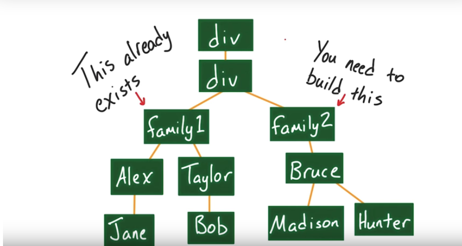

# jQuery quiz

Fork this <a href="https://codepen.io/morfioce/pen/WXbBoX">code pen</a>

## What's jQuery

>	jQuery is a fast, small, and feature-rich JavaScript library. It makes things like HTML document traversal and manipulation, event handling, animation, and Ajax much simpler with an easy-to-use API that works across a multitude of browsers.
																			 -- jQuery documentation

## Add/remove classes from an element using .toggleClass()

Use the `toggleClass` to remove the class featured

<a href="http://api.jquery.com/toggleclass/">Documentation on .toggleClass()</a>

## Get the sublings of an element using .next() and .prev()'

Use the `.prev()` or `.next()` method to add `featured` class to main-article sublings.

<a href="http://api.jquery.com/next/">Documentation on .next()</a>

## Changing the properties of an element using .prop()

Use `.first()` and `.prop()` to add an `href` property to the first anchor tag.

## Change the css of an element using .css()

Use `.css()` method to set the `font-size` to 20 px for all paragraphs

## Change the text or html of element using .text() and .html()

Use the `text()` and `.val()` method to change the heading each time the user type in the input field.

<a href="http://api.jquery.com/val/">Documentation on .val()</a>

<a href="http://api.jquery.com/html/">Documentation on .html()</a>

<a href="http://api.jquery.com/text/">Documentation on .text()</a>

## .remove()

Use `.remove()` to remove the last item in the list.

<a href="http://api.jquery.com/remove/">Documentation on .remove()</a>

## Insert elements using .append()/.prepend() and .insertBefore()/.insertAfter()

Use the above methode to add HTML elements to our page and try to tell the difference.

<a href="http://api.jquery.com/append/">Documentation on .append()</a>

<a href="http://api.jquery.com/prepend/">Documentation on .prepend()</a>

<a href="http://api.jquery.com/insertBefore/">Documentation on .insertBefore()</a>

<a href="http://api.jquery.com/insertAfter/">Documentation on .insertAfter()</a>

## Building a DOM tree

Try to build the following DOM tree

	

## Iterating with Each

Iterate over all paragraphs and add the number of characters at the end as part the paragrph text.

<a href="http://api.jquery.com/each/">Documentation on .each()</a>

## Why jQuery is so popular ?

You have had the chance to try it out? Why do so many developers use jQuery?

* Fast selection

* Easy DOM manipulation

* Cross-Browser compatibility

* Faster page loads

* It makes you happy

* Other reasons

## Tips

Want faster page loads? Use a CDN!

It's also worth noting that because so many websites use jQuery, there's a very good chance that your users' browsers have already cached the same copy of jQuery that you want to use.

If you use a CDN, your users' browsers will recognize that they already have a cached copy of jQuery from the same CDN when your site loads, which means that they don't need to download it again. So those extra KBs from jquery.min.js won't be downloaded and your site will load faster!