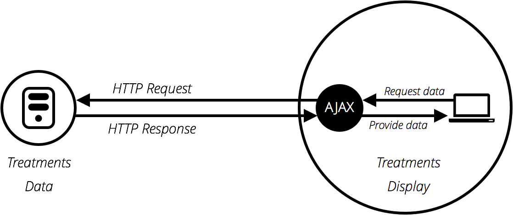

# Fetching data from the server

Another very common task in modern websites and applications is retrieving individual data items from the server to update sections of a webpage without having to load an entire new page.

This seemingly small detail has had a huge impact on the performance and behavior of sites, so in this introduction we will explain the concepts and look at technologies that make it possible.

## What's the problem here?

Originally page loading on the web was simple — you'd send a request for a web site to a server, the assets that made the web page (html, css, javascript, images, ...) would be downloaded and displayed on your computer.

<p align="center">
	
</p>

The trouble with this model is that whenever you want to update any part of the page, for example to display a new set of products or load a new page, you've got to load the entire page again. This is extremely wasteful and results in a poor user experience, especially as pages get larger and more complex.

### Enter Ajax

This led to the creation of technologies that allow web pages to request small chunks of data such as:

* HTML
* XML
* JSON
* Plain text

and display them only when needed, helping to solve the problem described above.

<p align="center">
	
</p>

The Ajax model involves using a web API as a intermediary to more intelligently request data rather than just having the browser to reload the entire page. Let's think about the significance of this:

1. Go to one of your favorite information-rich sites, like Amazon, YouTube, CNN, etc., and load it.

2. Now search for something, like a new product. The main content will change, but most of the surrounding information, like the `header`, `footer`, `navigation menu`, etc., will stay the same.

This is a really good thing because:

* Page updates are a lot quicker and you don't have to wait for the page to refresh, meaning that the site feels faster and more responsive.

* Less data is downloaded on each update, meaning less wasted bandwidth. This may not be such a big issue on a desktop on a broadband connection, but it's a major issue on mobile devices and in developing countries that don't have ubiquitous fast Internet service.

## A Basic Ajax request

Let's look at how such a request is handled, using both XMLHttpRequest and Fetch. For these examples, we'll request data out of a few different text files, and use them to populate a content area.

This series of files will act as our fake database; in a real application we'd be more likely to use a server-side language like PHP, Python, or Node to request our data from a database. Here however we want to keep it simple, and concentrate on the client-side part of this.

### XMLHttpRequest

XMLHttpRequest (which is frequently abbreviated to XHR) is a fairly old technology now — it was invented by Microsoft in the late 1990's, and has been standardized across browsers for quite a long time.

In order to understand ajax we will guide to build a small web application that loads different verse of a poem via XHR when it's selected in the drop down menu.

1. To begin this example, make a local copy of <a href="active_learning/index.html">index.html</a> and the four text files — <a href="active_learning/verse1.txt">verse1.txt</a>, <a href="active_learning/verse2.txt">verse2.txt</a>, <a href="active_learning/verse3.txt">verse3.txt</a>, and <a href="active_learning/verse4.txt">verse4.txt</a>

2. Just inside the `<script>` element, add the following code. This stores a reference to the `<select>` and `<pre>` elements in variables, and defines an onchange event handler function so that when the select's value is changed, its value is passed to an invoked function `updateDisplay()` as a parameter.
```javascript
var verseChoose = document.querySelector('select');
var poemDisplay = document.querySelector('pre');

verseChoose.onchange = function() {
  var verse = verseChoose.value;
  updateDisplay(verse);
};
```

3. Let's define our `updateDisplay()` function. First of all, put the following beneath your previous code block — this is the empty shell of the function:
```javascript
function updateDisplay(verse) {

};
```

4. We'll start our function by constructing a relative URL pointing to the text file we want to load, as we'll need it later. The value of the `<select>` element at any time is the same as the text inside the selected `<option>` (unless you specify a different value in a value attribute) — so for example "Verse 1". The corresponding verse text file is "verse1.txt", and is in the same directory as the HTML file, therefore just the file name will do.
However, web servers tend to be case sensitive, and the file name hasn't got a space in it. To convert "Verse 1" to "verse1.txt" we need to convert the V to lower case, remove the space, and add .txt on the end. This can be done with `replace()`, `toLowerCase()`, and simple string concatenation. Add the following lines inside your `updateDisplay()` function:
```javascript
verse = verse.replace(" ", "");
verse = verse.toLowerCase();
var url = verse + '.txt';
```

5. To begin creating an XHR request, you need to create a new request object using the `XMLHttpRequest()` constructor. You can call this object anything you like, but we'll call it request to keep things simple. Add the following below your previous lines:
```javascript
var request = new XMLHttpRequest();
```

6. Next, you need to use the `open()` method to specify what HTTP request method to use to request the resource from the network, and what its URL is. We'll just use the `GET` method here, and set the URL as our url variable. Add this below your previous line:
```javascript
request.open('GET', url);
```

7. Next, we'll set the type of response we are expecting — which is defined by the request's responseType property — as text. This isn't strictly necessarily here — XHR returns text by default — but it is a good idea to get into the habit of setting this in case you want to fetch other types of data in the future. Add this next:
```javascript
request.responseType = 'text';
```

8. Fetching a resource from the network is an asynchronous operation, meaning that you've got to wait for that operation to complete (e.g., the resource is returned from the network) before you can then do anything with that response, otherwise an error will be thrown. XHR allows you to handle this using its `onload` event hander — this is run when the `load` event fires (when the response has returned). When this has occurred, the response data will be available in the `response` property of the XHR request object.
Add the following below your last addition. you'll see that inside the onload event handler we are setting the textContent of the poemDisplay (the `<pre>` element) to the value of the request.response property.
```javascript
request.onload = function() {
  poemDisplay.textContent = request.response;
};
```

9. The above is all setup for the XHR request — it won't actually run until we tell it to, which is done using the `send()` method. Add the following below your previous addition to complete the function:
```javascript
request.send();
```

10. One problem with the example as it stands is that it won't show any of the poem when it first loads. To fix this, add the following two lines at the bottom of your code (just above the closing `</script>` tag) to load verse 1 by default, and make sure the `<select>` element always shows the correct value:
```javascript
updateDisplay('Verse 1');
verseChoose.value = 'Verse 1';
```

## Ajax with jQuery

Read the following articles

1. <a href="https://learn.jquery.com/ajax/">What's ajax</a>

2. <a href="https://learn.jquery.com/ajax/key-concepts/">Key concepts</a>

3. <a href="https://learn.jquery.com/ajax/jquery-ajax-methods/">jQuery's Ajax related methods</a>

### Active learning

Try to re-do the previous ajax example using jQuery's ajax method.