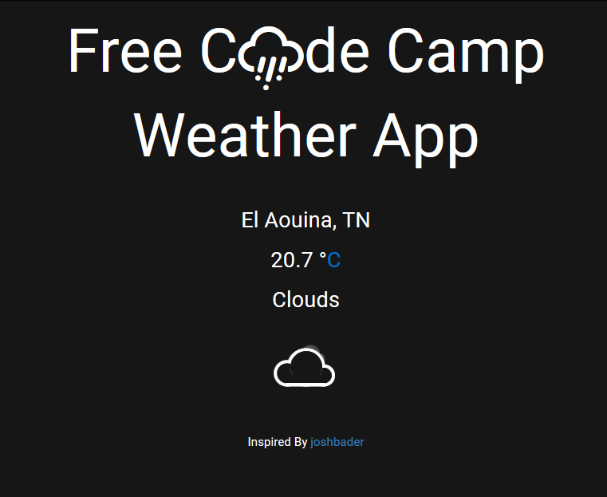

# Show the Local Weather

	

1. Objective: Build a <a href="https://codepen.io/">CodePen.io</a> app that is funcionally similar to this http://codepen.io/FreeCodeCamp/full/bELRjV.

2. <strong>Rule #1</strong> Don't look at the example project's code. Figure it out for yourself.

3. <strong>Rule #2</strong> Fulfill the below user stories. Use whichever libraries or APIs you need. Give it your own personal style.

4. <strong>User Story</strong> I can see the weather in my current location.

5. <strong>User Story</strong> I can see a different icon or background image (e.g. snow mountain, hot desert) depending on the weather.

6. <strong>User story</strong> I can push a button to toggle between Fahrenheit and Celsius.

>	Note: Many internet browsers now require an HTTP Secure (https://) connection to obtain a user's locale via HTML5 Geolocation. For this reason, we recommend using HTML5 Geolocation to get user location and then use the freeCodeCamp Weather API https://fcc-weather-api.glitch.me which uses an HTTP Secure connection for the weather. Also, be sure to connect to CodePen.io via https://.

>	Remember to use Read-Search-Ask if you get stuck.