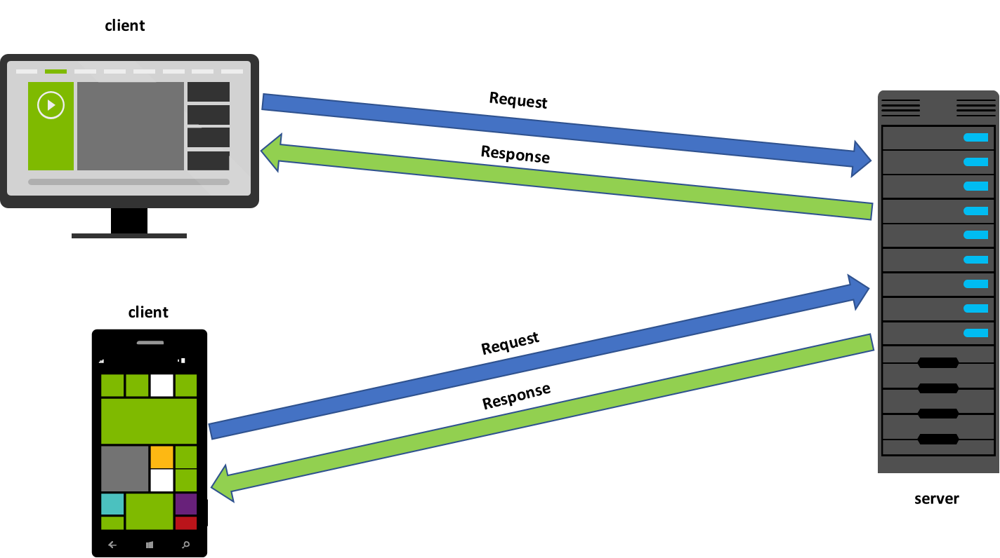

## Structure of the Backend

The backend, or server-side, of a web application consists of several components, commonly referred to as <stron>tiers</stron> or <strong>layers</strong>. We refer to the backend as the server-side of a web app because the backend of a web application is hosted on a web server.

The most common layers of a web application are:

* <strong>the presentation layer</strong>: This layer is part of the client-side of an application and refers to the user interface of an application. The user interface of a web app includes any HTML, CSS and JavaScript code that runs in the browser to display the webpages that make up the app's interface.

* <strong>the application layer</strong>: This layer handles the logic that makes the web application function. This refers to any of the operations and algorithms that must be carried out in the background in order to handle the business operations of the app.

* <strong>the data layer</strong>: This layer stores, organizes and manages access to an application's data using a database.

Web applications can be built in several different ways. Sometimes the application layer will be part of the client-side, sometimes it will be shared across the client-side and server-side, and sometimes it will be part of the server-side.

In this course, we'll handle a majority of application logic in the backend. This means that if your app needs to process data before it can be displayed, you'll write the code for most of that processing on your server, the server will return that processed data, and all the client will need to do is display it appropriately.

	

The <strong>web server</strong> handles requests for web content and serves the content to clients. This involves identifying the resources that a client is asking for, such as the homepage html file, or a css stylesheet, and returning those resources. Both static websites and dynamic web apps utilize web servers to handle requests for web resources.

In addition to a web server, web applications also contain an <strong>application server</strong>. This is the component you will program to handle the logic and algorithms that your app needs to perform. This includes handling requests from the client for data, communicating with the database, performing any necessary changes or modifications, and then returning that data to the client.

The <strong>database</strong> is where the data for an application is stored. The database stores, organizes and provides access to an application's data.

In summary, a web server will contain an <strong>application server</strong> that correlates to the application layer of your app, and a <strong>database</strong> which correlates to the data layer of your app. These are the 2 components that you will program as the back-end developer.

We'll take a deeper look at each of these components throughout this course.