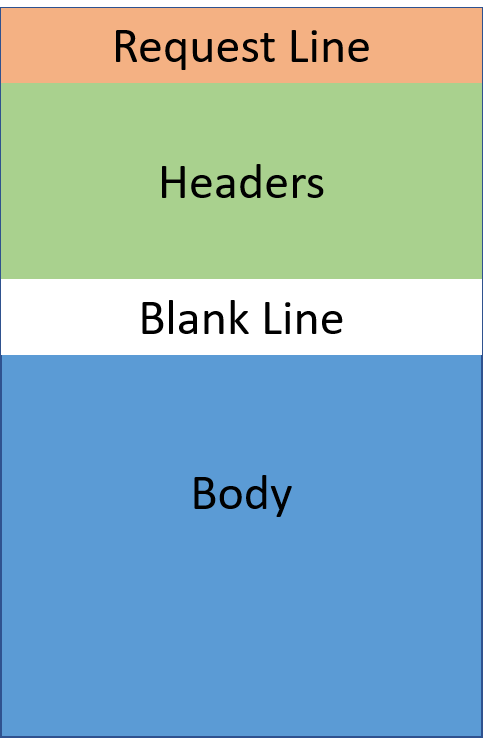

##HTTP Requests

Web clients use HTTP to send requests to servers to obtain or modify stored data.

### HTTP Request Methods

HTTP defines a set of methods that clients can use to request information from web servers. Remember that these methods correspond to the CRUD operations that can be performed on data:

* <strong>Creating data</strong>:

Clients use the HTTP `POST` method to insert or update data on the server. This is the method used when HTML forms need to send form data to the server.

Clients use the HTTP `PUT` method to create or update data on the server. This method is similar to the POST method.

* <strong>Reading data</strong>:

Clients can use the HTTP `GET` method to `retrieve` information from a server. This is useful in scenarios where the client needs to ask for the details of a stored object, a list of objects that are being stored, or search for something that the user is requesting.

For example, when a user browses a shopping site and navigates to the "pants" page, the browser will send a GET request to the app's server requesting a list of all pants for sale and then display those results on the page.

The client may optionally pass parameters that give the server more information about the request, such as the id or name of the specific object the client wants to locate.

* <strong>Updating data</strong>: The HTTP `PUT` or `POST` methods

* <strong>Deleting data</strong>:

Clients use the HTTP `DELETE` method to delete resources from the server.

### Format of an HTTP Request

HTTP request messages consist of a <strong>request</strong> line, an optional <strong>header</strong> and an optional message <strong>body</strong>.

    

<strong>The Request Line</strong>

When a client sends an HTTP request to a server, it needs to include some key information about the request:

* <strong>Request method</strong>: What type of request is being made? (GET, PUT, POST or DELETE)

* <strong>a URI to identify the resource involved in the request</strong>:   Where is the request being made to?

* <strong>HTTP Version #</strong>: To make it clear which protocol is being used in the communication

This information is included in the <strong>request</strong> line of an HTTP Request message.

For example, in a Q&A forum, the HTTP request lines would be used as follows to access and modify questions. Let's assume the server URL in this scenario is www.askquestions.com and that the URI for the question resource is <strong>/questions</strong>.

<strong>NOTE</strong>: The request method type should always be written in uppercase letters.

* Create- add a new question:

    POST /questions HTTP/1.1

* Read- view question number 3:

    GET /questions/3 HTTP/1.1

* Read- view all questions:

    GET /questions HTTP/1.1

* Update- Modify question number 2:

    PUT /questions/2 HTTP/1.1

* Delete- Delete question number 4:

    DELETE /questions/4 HTTP/1.1

### The header and body

The <strong>header</strong> contains optional metadata about the request. The details of header fields are out of scope for this course.

The <strong>body</strong> contains the optional parameters for the request, and/or any data being sent to the server. If a client sends a POST request after a user fills out a form, the form data would be sent within the body of the message. 