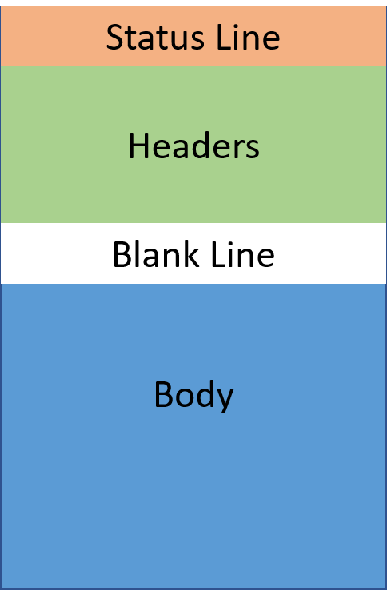

##HTTP Responses

Web servers use HTTP to send responses to clients who have made requests.

HTTP response message consists of a <strong>status</strong> line, an optional <strong>header</strong> and an optional message <strong>body</strong>.

	

The <strong>status line</strong> tells the client the result of the requested operation. Status codes are written using 3 digit codes. You may have seen a few of these codes if you've ever run into a missing webpage or an error online. The most common are:

* 200: This code means "OK". This status is sent when the server completed operation successfully.

* 400: This code means "Bad Request". This status is sent when the server couldn't understand the client request.

* 404: This code means "Not Found". This status is sent when the server could not locate the requested resource.

Similarly to HTTP request messages, response messages also contain headers and a body.

The <strong>header</strong> contains optional metadata about the response. The details of header fields are out of scope for this course.

The <strong>body</strong> contains any data or resource the server is providing in response to the request. This can be an HTML file the client requested, or data from the database.