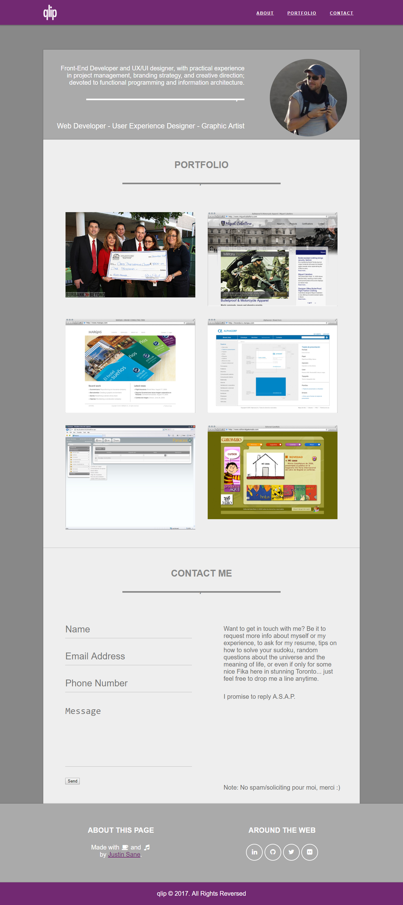

# Build a Personal Portfolio Webpage

Build a portfolio that is functionally similar to the below image.

	

## Project user stories

1. User story: I can access all of the portfolio webpage's content just by scrolling.

2. User story: I can click different buttons that will take me to the portfolio creator's different social media pages

3. User story: I can see thumbnail images of different projects the portfolio creator has built (if you haven't built any websites before, use placeholders.)

4. User story: I navigate to different sections of the webpage by clicking buttons in the navigation.

>	Don't worry if you don't have anything to showcase on your portfolio yet - you will build several apps on the next few weeks challenges, and can come back and update your portfolio later.

>	There are many great portfolio templates out there already. However, you should consider building your portfolio page as much as you can from the ground up. Using only HTML and CSS.

>	Remember to use Read-Search-Ask if you get stuck.

>	You can get feedback on your project by sharing it with your friends on Facebook.