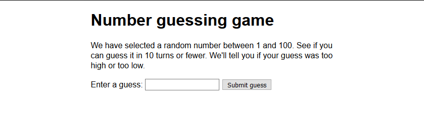

# Number Guessing Game

## Objective

To have a first bit of experience at writing some JavaScript, and gain at least a basic understanding of what writing a JavaScript program involves.

>	Thinking like a programmer: One of the hardest things to learn in programming is not the syntax you need to learn, but how to apply it to solve real world problems. You need to start thinking like a programmer — this generally involves looking at descriptions of what your program needs to do and working out what code features are needed to achieve those things, and how to make them work together.

>	This requires a mixture of hard work, experience with the programming syntax, and practice — and a bit of creativity. The more you code, the better you'll get at it. We can't promise that you'll develop "programmer brain" in 5 minutes, but we will give you plenty of opportunity to practice thinking like a programmer throughout the mini-projects and exercises.

In this mini project we will show you how to build up the simple game you can see below:

	

Try the <a href="https://codepen.io/morfioce/pen/gGBXVp">live example</a> (<strong>no picking at the source code</strong>)

## Game instructions

1. Generate a random number between 1 and 100.
2. Record the turn number the player is on. Start it on 1.
3. Provide the player with a way to guess what the number is.
4. Once a guess has been submitted first record it somewhere so the user can see their previous guesses.
5. Next, check whether it is the correct number.
6. If it is correct:
    1. Display congratulations message.
    2. Stop the player from being able to enter more guesses (this would mess the game up).
    3. Display control allowing the player to restart the game.
7. If it is wrong and the player has turns left:
    1. Tell the player they are wrong.
    2. Allow them to enter another guess.
    3. Increment the turn number by 1.
8. If it is wrong and the player has no turns left:
    1. Tell the player it is game over.
    2. Stop the player from being able to enter more guesses (this would mess the game up).
    3. Display control allowing the player to restart the game.
9. Once the game restarts, make sure the game logic and UI are completely reset, then go back to step 1.

