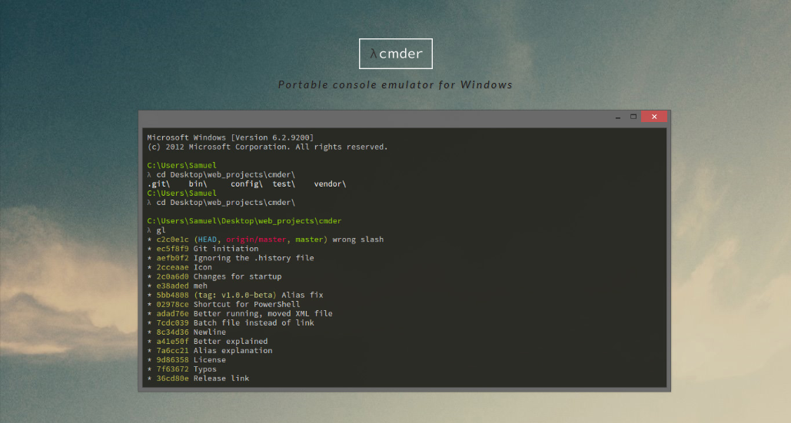

# Commmand Line Basics -- part I

## Shell or terminal

So, basically, Shell is a program that receives commands from the user and gives it to the OS to process and it shows the output.

## `Cmder` for windows users

* Install a better <a href="http://cmder.net/">acommand line</a>

  

## Basic commands

1. `pwd` When you first open the terminal, you are in the home directory of your user. To know which directory you are in, you can use the “pwd” command.

2. `ls` The “Is” command is used to know what files are there in the directory you are in. You can see all the hidden files by using the command `ls -a`

3. `cd` is the command used to go to a directory. For example, if you are in the home folder, and you want to go to the Downloads folder, then you can type in `cd Downloads`.

4. The `mkdir` command is used when you need to create a folder or a directory. For Example, if you want to make a directory called “DIY”, then you can type `mkdir DIY`.

5. `rmdir` is the command used for deleting a directory. But, `rmdir` can only be used to delete an empty directory. To delete a directory containing files, `rm` is used.

6. The `rm` command is used to delete files and directories. `rm` cannot simply delete a directory. `rm -r` is used to delete a directory. In this case, it deletes both the folder and the files in it.

7. The `touch` command is used to create a file. It can be anything, from an empty txt file to an empty zip file. For example – `touch new.txt`
